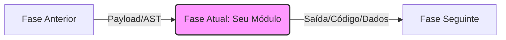
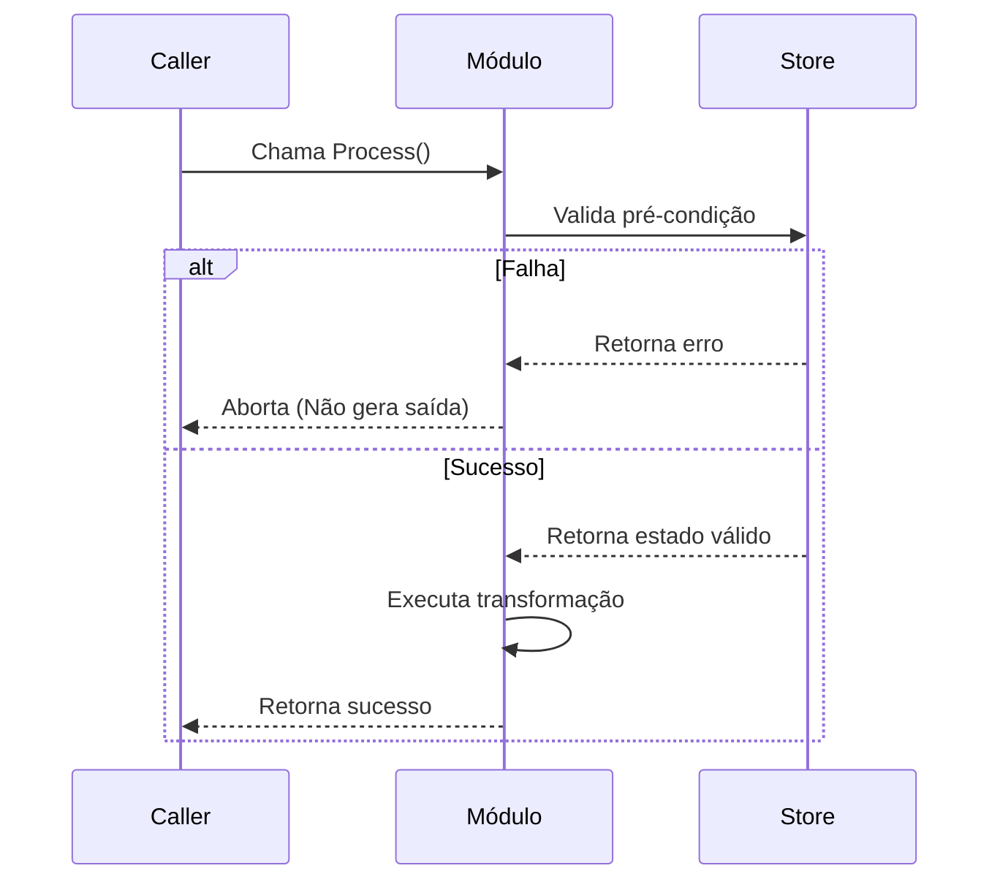

# Design — [Nome do Módulo ou Funcionalidade]

> Define **como** atender os requisitos definidos em `requirements.md`. Estende os documentos de design anteriores, reusando seus invariantes e modelos de dados.

## 1. Diretivas para o Agente (AI Instructions)
> **Nota para o Claude Code:** Este documento define a arquitetura estrita a ser seguida. 
> - Não invente novas estruturas de diretórios que não estejam definidas aqui.
> - **TODOS os fluxogramas, diagramas de estado e arquitetura devem ser expressos utilizando a sintaxe `mermaid`.** Não utilize ASCII art para diagramas complexos.
> - Siga fielmente o mapeamento de tipos e os algoritmos descritos nas seções abaixo.

## 2. Visão Arquitetural

### 2.1. Onde o trabalho mora
[Descreva em qual parte do pipeline ou do sistema essa funcionalidade se encaixa. O que vem antes e o que vem depois?]



### 2.2. Invariantes preservados

[Liste as regras inquebráveis do sistema que este design deve respeitar.]

* **[Invariante 1]:** [Ex: Separação rigorosa de fases, o módulo não pode realizar chamadas de rede diretas].
* **[Invariante 2]:** [Ex: Toda saída gerada deve ser determinística].

---

## 3. Estrutura de Pacotes (Delta)

[Liste apenas os pacotes, pastas ou arquivos **novos** ou **modificados** por este design. Use notação de árvore padrão.]

```text
src/
├── novo_pacote/             # Propósito do pacote
│   ├── arquivo_principal.go # Interface ou orquestrador
│   └── detalhes.go          # Implementação específica

```

**Direção de dependências:** [Ex: `novo_pacote` pode importar `ast` e `types`, mas nunca o pacote `cli`].

---

## 4. Componentes e Contratos

### 4.1. [Nome do Componente Principal] (Atende REQ-X)

[Descreva as structs, interfaces, ou classes fundamentais. Forneça o "esqueleto" do código, mas não a implementação completa.]

```go
// Exemplo de contrato que o agente deve implementar
type NomeDoComponente interface {
    Process(input InputType) (OutputType, error)
}

```

### 4.2. Estratégia de Mapeamento ou Transformação

[Se o módulo transforma dados (ex: AST para Código, ou JSON para Entidade), crie uma tabela de mapeamento exata. Isso impede que o agente invente nomes de variáveis.]

| Origem | Destino | Notas |
| --- | --- | --- |
| `Regra A` | `Comportamento X` | Utiliza a função Y |
| `Regra B` | `Comportamento Z` | Dispara o evento W |

---

## 5. Fluxos de Decisão Chave (Algoritmos)

[Descreva a lógica complexa usando pseudocódigo ou diagramas de sequência Mermaid. Isso garante que o agente acerte os edge cases.]

### 5.1. Fluxo de [Nome do Processo Crítico]



---

## 6. Estratégia de Testes (NFR-X)

[Como o Claude Code deve provar que esse design funciona?]

* **[Tipo de Teste]:** [Ex: Golden tests por emissor comparando a saída com um artefato de referência].
* **[Casos Específicos]:** [Ex: Testar o comportamento quando a entrada possui nós de erro].

---

## 7. Decisões e Trade-offs Registrados

[Mantenha um histórico de por que uma abordagem foi escolhida em detrimento de outra. Isso impede que o agente ou outro desenvolvedor tente "refatorar" para a alternativa rejeitada no futuro.]

| Decisão | Alternativa | Por quê |
| --- | --- | --- |
| [O que faremos] | [O que rejeitamos] | [Razão, ex: Reduz acoplamento, atende NFR-Y] |

---

## 8. Riscos e Mitigações

| Risco | Mitigação |
| --- | --- |
| [Ex: O código gerado não compila] | [Ex: Adicionar um passo de validação ou formatação automática no final do processo] |
