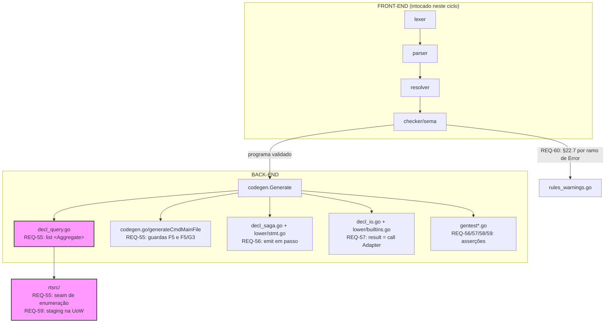
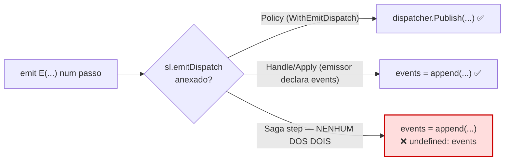
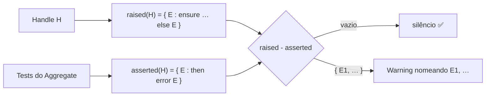
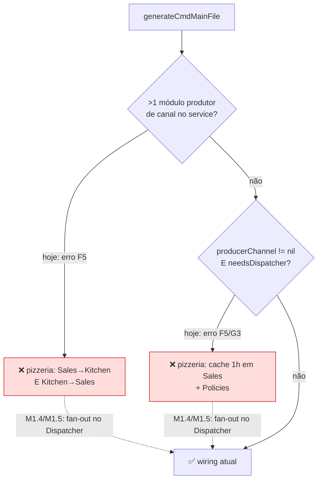

# Design — Conclusão das dívidas remanescentes (ISSUE-6, ISSUE-8, ISSUE-12)

> Define **como** atender `requirements.md` (REQ-55..61, NFR-31..33). Estende os
> designs do Marco I (Read Side), Marco H4 (`*.test.ds` → Go) e Marco L.
>
> **Diferença de método em relação ao Marco L:** toda análise de raiz abaixo foi
> confirmada por **leitura do código E reprodução**, antes de virar task. A §7
> registra o que foi verificado, como, e o que a verificação mudou.

## 1. Diretivas para o Agente (AI Instructions)

- Não invente estruturas de diretórios: tudo mora nos pacotes que já existem
  (`codegen/`, `codegen/lower/`, `codegen/rtsrc/`, `sema/`).
- **Diagramas em `mermaid`**, nunca ASCII art.
- **Antes de implementar, releia a seção de design referenciada no frontmatter
  da task.** Se o código divergir do que esta seção afirma, **pare e reporte** —
  não improvise um fix alternativo. Foi exatamente assim que o Marco L acumulou
  quatro tasks com premissa errada.
- **Nunca substitua um gap por Go que não compila.** Toda forma não suportada
  descoberta durante a execução vira erro de geração claro (NFR-33).

---

## 2. Visão Arquitetural

### 2.1. Onde o trabalho mora

Todo o ciclo é back-end, exceto REQ-60 (checker semântico). Nenhuma fase toca
léxico/parser — por construção: o que exigiria gramática nova foi delimitado
(REQ-61).



### 2.2. Invariantes preservados

- **O gerador nunca re-lexa/re-parseia/re-valida** (REQ-14.1): entradas são só
  `program.Program`, `symbols.SymbolTable` e `types.Model`.
- **Determinismo (NFR-13):** regenerar o mesmo programa é byte-idêntico. Vale
  para a enumeração de streams (**ordem estável**, ver §5.1) e para o shrinking
  (semente fixa, §4.5).
- **Núcleo do runtime sem deps externas (NFR-12/32):** `rtsrc/` é stdlib pura.
- **A interface `runtime.EventStore` não muda** (NFR-32): a enumeração entra
  como interface **opcional**, descoberta por type assertion — `sqlrt.EventStore`
  e os dublês de teste em `codegen/*_test.go` continuam compilando intocados.
- **Fronteira de spec é parada, não adivinhação:** `released`, acesso NEGADO,
  §4.4 e §25 são delimitados (REQ-61), nunca inventados.

---

## 3. Estrutura de Pacotes (Delta)

```text
codegen/
├── decl_query.go          # + tryEmitListAggregate (REQ-55.3/55.4)
├── codegen.go             # guardas F5 e F5/G3 → wiring suportado (REQ-55.7/55.8)
├── decl_saga.go           # + detecção de emit em passo (REQ-56.1) e a rota de §4.3
├── decl_io.go             # Call<Nome> com valor de retorno (REQ-57.2)
├── gentest.go             # emitSagaThenAssert "emitted", emitSagaMock, rolledback
├── gentest_property.go    # shrinking determinístico (REQ-58)
├── lower/
│   ├── stmt.go            # + hoistListAggregate (REQ-55.4)
│   ├── env.go             # ItemTypeOf para "list <Aggregate>" (REQ-55.3)
│   └── builtins.go        # QueryExpr.Op "call" deixa de ser erro (REQ-57.2)
└── rtsrc/
    ├── eventstore.go.txt  # + StreamLister opcional + impl in-memory (REQ-55.1/55.2)
    └── uow.go.txt         # staging em memoryTx (REQ-59)

sema/
└── rules_warnings.go      # cobertura §22.7 por ramo de Error (REQ-60)

.github/workflows/ci.yml   # pizzeria sai de KNOWN_UNGENERATABLE (REQ-55.10)
.claude/specs/codegen/gaps.md   # delimitações e reclassificações (REQ-61)
```

**Direção de dependências (inalterada):** `driver → sema → resolver → parser →
lexer → ast/token/diag`; `codegen` depende de `program`/`symbols`/`types` e
nunca o contrário. `codegen/rtsrc/` é fonte vendorizada — não importa nada de
`codegen`.

---

## 4. Componentes e Contratos

### 4.1. Seam de enumeração de streams (Atende REQ-55.1/55.2)

**Análise de raiz (verificada).** `runtime.EventStore` tem exatamente dois
métodos, ambos por `aggregateID`:

```go
type EventStore interface {
    Append(ctx context.Context, aggregateID string, events []Event) error
    Load(ctx context.Context, aggregateID string) ([]Event, error)
}
```

Não há **nenhuma** primitiva de enumeração — nem por tipo de Aggregate, nem em
geral. `memoryEventStore.streams` é um `map[string]*tenantStream` chaveado por
`aggregateID`; o `tenantStream` guarda o tenant, **não** o tipo do Aggregate. Ou
seja, `list <Aggregate>` não tem como ser gerado hoje nem em princípio: falta a
informação e falta o método.

**Contrato novo — interface opcional, não extensão de `EventStore`:**

```go
// StreamLister é o seam OPCIONAL de enumeração por tipo de Aggregate. NÃO faz
// parte de EventStore de propósito (NFR-32): sqlrt.EventStore e os dublês de
// teste de codegen/ satisfazem EventStore hoje e continuam satisfazendo — quem
// precisa de enumeração descobre este seam por type assertion.
type StreamLister interface {
    // ListStreams devolve, em ordem ESTÁVEL (ver §5.1), os aggregateID já
    // escritos para aggregateType, filtrados pelo mesmo critério de tenant que
    // Load aplica (§13.2): um stream de outro tenant simplesmente não aparece
    // — nunca ErrNotFound, porque enumerar não é endereçar.
    ListStreams(ctx context.Context, aggregateType string) ([]string, error)
}
```

`memoryEventStore` implementa `StreamLister`; para isso `tenantStream` ganha um
campo `aggregateType`, carimbado no **primeiro** `Append` do stream — pelo mesmo
mecanismo e no mesmo ponto onde `tenantID` já é carimbado hoje. O tipo chega a
`Append` por uma via a decidir na task M1.1 (ver §5.1); a decisão é registrada
lá, não aqui.

`sqlrt.EventStore` **não** implementa `StreamLister` neste ciclo (fora de escopo,
§1.3 de `requirements.md`): um programa que use `list <Aggregate>` com provider
real recebe o erro claro de REQ-55.5.

### 4.2. `list <Aggregate>` em `EmitQuery` (Atende REQ-55.3/55.4)

**Análise de raiz (verificada por reprodução).** `dsc gen docs/examples/pizzeria`
falha em `Query GetBoardTickets` com:

> `return: forma não suportada por EmitQuery (E8.1) … list … em posição de
> expressão pura não é suportado por Lowerer.Expr`

O caminho: `emitReturn` (`decl_query.go`) vê `Op == "list"`, tenta
`tryEmitListVO`, que devolve `handled=false` porque `Target` **não** resolve a um
`*types.VOType` (resolve ao Aggregate); cai em `tryEmitHoistedQueryReturn`, que
exige `Op == "load"` e devolve `false`; cai no fallback `qc.l.Expr(ret.Value)`,
que rejeita `QueryExpr` em posição pura. **É provider-agnóstico** — trocar o
provider de `Kitchen` não muda nada.

**Mapeamento das formas de `list`:**

| Forma na fonte | Semântica | Estado hoje |
|---|---|---|
| `list <VO>` (sem cláusula) | itens do campo `AppendList<VO>` de **uma** instância, correlacionada | suportado (`tryEmitListVO`, ramo E8.1) |
| `list <VO> [cláusulas]` | idem, com `where`/`orderBy`/`skip`/`take`/`as` | suportado (reescrito para `load Agg(p).<campo> […]`) |
| `list A a join B b on …` | join de duas fontes | suportado (`emitHoistedJoinReturn`) |
| **`list <Aggregate> [cláusulas]`** | **todas as instâncias** do Aggregate | **erro — esta task** |

**Fix na raiz.** Um novo fast-path `tryEmitListAggregate`, irmão de
`tryEmitListVO`, reconhecido quando `Target` é um `Ident` que resolve a um
Aggregate. Ele **não** duplica a máquina de cláusulas: reusa
`hoistQueryPredicate`/`hoistOrderBy`/`hoistSkipTakeExpr` e `runtime.SelectSlice`
exatamente como `hoistLoadCollection` (`lower/stmt.go`) já faz — só a **fonte**
da coleção muda.

| `hoistLoadCollection` (I3.1, existente) | `hoistListAggregate` (novo) |
|---|---|
| Passo 1: `Load<Agg>(loader, id)` → **uma** instância | Passo 1: `ListStreams(ctx, "<Agg>")` → ids; loop `Load<Agg>` por id → `[]<aggState>` |
| Passo 2: monta `Query[T]` — `hoistQueryPredicate`/`hoistOrderBy`/`hoistSkipTake` | **idêntico, reusado sem alteração** |
| Passo 3: `SelectSlice(agg.state.<Campo>.Items(), q)` | Passo 3: `SelectSlice(<items>, q)` |
| `as V`: `emitAsProjection` sobre o resultado | **idêntico** (`projectFieldAssignments` state→View) |

O **tipo do item** é o struct de state do Aggregate (`aggregateStateStructName`,
ex. `kitchenTicketState`) — é o que o binding (`t` em `list KitchenTicket t`)
denota, e é o que `projectFieldAssignments` já sabe projetar para uma View
(`aggShape.Fields` → `viewShape.Fields`, o mesmo par que `emitLoadAsView` usa).
`lower/env.go:ItemTypeOf` precisa passar a resolver essa forma.

### 4.3. Wiring de service: as duas guardas (Atende REQ-55.7/55.8)

**Análise de raiz (verificada).** `generateCmdMainFile` (`codegen/codegen.go`)
tem **duas** recusas explícitas, e o `pizzeria` bate nas **duas** — a spec do
Marco L só mapeou uma:

1. **Múltiplos produtores.** `Sales -> Kitchen` e `Kitchen -> Sales` são ambos
   canais `queue`, e ambos os módulos estão no service único
   `PizzeriaMonolith` → "mais de um módulo produtor de canal de saída via queue
   no mesmo service".
2. **Produtor + Dispatcher (F5/G3).** `needsDispatcher` é `true` porque
   `Sales.GetAvailableMenu` declara `cache { ttl: 1h }` (G3 assina o Dispatcher)
   — além de ambos os módulos terem Policy → "módulo com Policy/Query cacheada E
   módulo produtor de canal de saída no mesmo service".

**Causa comum.** A `UnitOfWork` aceita **um** `Publisher`
(`NewUnitOfWork(store, publisher...)`, `rtsrc/uow.go.txt`), então hoje o main.go
escolhe: ou o `dispatcher` publica, ou o canal publica — nunca os dois. Com dois
produtores, nem sequer há um canal único a escolher.

**Direção do fix (a decidir e registrar em M1.4, antes de código).** A rota
recomendada é **fan-out no Dispatcher**: a UoW publica sempre no `dispatcher`
(um só `Publisher`, contrato intocado), e **cada canal de saída assina o
Dispatcher** para os `PublicEvent` que atravessa — em vez de ser o publisher
direto. Isso resolve as duas guardas de uma vez (N produtores viram N
assinaturas) e reusa o mecanismo de subscrição que Policy/cache/Metric já usam,
sem tocar `Step`/`RunSaga` nem o contrato de `UnitOfWork`. A task M1.4 confirma
ou refuta essa rota **por leitura**, registra a decisão aqui, e só então M1.5
implementa.

### 4.4. `emit` em passo de Saga (Atende REQ-56)

**Análise de raiz (verificada — a premissa do Marco L estava errada).** ISSUE-6
afirmava "erro de geração claro". **Não é.** `emitSagaStepPhaseFunc`
(`codegen/decl_saga.go`) monta o `StmtLowerer` com `.WithNotifyAdapters(...)`
mas **sem** `.WithEmitDispatch(...)`. Sem `emitDispatch`, `StmtLowerer.emitStmt`
(`lower/stmt.go`) cai no ramo:

```go
sl.e.Line("events = append(events, &%s)", goExpr)
```

…mas a assinatura de um passo é `func(ctx, state *S) error` — **não existe
`events` no escopo**. Resultado: `dsc gen` sai **0** e o Go emitido não compila
(`undefined: events`). É **miscompilação silenciosa**, o pior caso possível.



**Fix em duas etapas, deliberadamente separadas:**

- **M2.1 (imediato, independente):** detectar `emit` no corpo de
  `up`/`down`/`onInfraError` e **falhar a geração** com mensagem clara. Fecha a
  lacuna de segurança sem prometer a feature.
- **M2.2 (design) → M2.3/M2.4 (implementação):** como um passo emite. Rotas, com
  o que já se sabe:

| Rota | O que habilita | Custo | Nota |
|---|---|---|---|
| **(i) Dispatcher publish-only** | o passo publica; a coleta de §22.4 vira reusável | baixo | não cobre `Order emitted …` (Aggregate emitindo) |
| **(ii) `Tx` no passo** | despachar `Handle` de Aggregate de dentro do passo — o exemplo literal de §22.3 | alto | muda `Step[S]`/`RunSaga` (`rtsrc/saga.go.txt`), mexe no núcleo transacional |
| **(iii) Delimitar** | nada além de M2.1 | zero | fecha a lacuna sem a feature |

Verificado no runtime: `Step[S]` tem `Up/Down/OnInfraError func(ctx, state *S)
error` — `state` é o **único** receptor, sem `Tx` nem `EventStore` (o próprio
`decl_saga.go` documenta que `storeGoName` fica vazio por isso). O `SagaStore` de
`mode async` guarda `SagaStatus`, não eventos.

### 4.5. `mock … returns X`, shrinking e staging (Atende REQ-57/58/59)

**`mock … returns X` (REQ-57) — três camadas ausentes, verificadas:**

1. **Sem canal de valor.** `Call<Nome>` é emitido como
   `func Call<Nome>(ctx, n <Notif>) error` (`decl_io.go`) — só `error`.
2. **Sem forma que consuma o valor.** `result = call Adapter(...)` (§18.2 — está
   no **exemplo de Saga do próprio spec**) passa o front-end e falha a geração:
   `QueryExpr.Op "call" … não é suportado` (`lower/builtins.go`). Nunca foi
   implementada.
3. **Sem contrato de resposta.** Nenhuma seção do spec define tipo de resposta
   para `Adapter`/`Notification`; o `PaymentResult(...)` do exemplo §22.3 **não é
   declarado em lugar nenhum**.

Por isso a fase M3 começa por **M3.1 (design)**: sem contrato de resposta não há
tipo que `X` possa assumir. Só depois vêm `result = call …` (M3.2) e o mock com
valor efetivo (M3.3) — e o sintoma original (`emitSagaMock` faz `_ = goExpr`) é
a **última** camada, não a primeira.

**Shrinking (REQ-58).** `gentest_property.go` já é determinístico por
construção: `rand.New(rand.NewSource(propertySeed(t.Name, pr.Name)))`, semente
derivada do par de nomes, nunca de `time.Now`. O contra-exemplo hoje é a
sequência **completa** (`dsPropStep`), e o cabeçalho do arquivo já documenta a
ausência de shrinking e o caminho: "re-executar prefixos candidatos contra o
MESMO seed determinístico". O fix é exatamente isso — encolher por
remoção/bissecção, re-testando cada candidata a partir do mesmo state seedado,
e reportar a menor que ainda viola. Sem shrinking no caminho verde (REQ-58.3).

**Staging (REQ-59).** `memoryUnitOfWork.Run` chama `fn(tx)` e retorna o erro;
`memoryTx.Append` grava **direto** em `store.Append` e só acumula `tx.appended`
para a publicação pós-commit. O tipo já documenta: "commit e rollback são
no-op… eventos já são duráveis no ato de Append". O fix: `Append` passa a
bufferizar; `Run` aplica o buffer à store **só** quando `fn` devolve `nil`;
`Load` concatena store + buffer daquele stream (read-your-writes, REQ-59.2); a
publicação pós-commit continua a partir do mesmo buffer, na mesma ordem.

⚠️ **Cuidado de ordem:** hoje `EventStore.Append` carimba `Sequence` a partir do
tamanho do stream já persistido. Com staging, o carimbo passa a acontecer no
**flush**, não no `Append` do `Tx` — dois `Append` ao mesmo stream no mesmo
`Run` devem produzir sequências contíguas. A task M4.2 valida isso
explicitamente.

### 4.6. Cobertura §22.7 por ramo de `Error` (Atende REQ-60)

**Análise de raiz (verificada — e a decisão que o Marco L deixou em aberto agora
está tomada: é viável em `sema`, sem re-arquitetura).** Os dois lados da
informação **já existem**; ambos são reduzidos a booleano cedo demais:

| Hoje | Tem a informação fina? |
|---|---|
| `handleRaisesError(module, h) bool` | **Sim** — percorre cada `ensure … else <Error>` via `astutil.ForEachStmt` e resolve o `Ident` a um `symbols.KindError`; só descarta o **nome** e devolve `raises bool`. |
| `testedErrorHandles() map[string]map[string]bool` | **Sim** — lê `sc.Then.Error`, que é o **nome** do Error (`ast.ThenClause.Error string`); só descarta o nome e marca o Handle como coberto. |

Basta trocar os dois booleanos por **conjuntos de nomes** e reportar a
diferença:



**Determinismo (REQ-60.6/NFR-3):** a diferença é iterada em ordem estável
(ordenar os nomes, ou percorrer os `ensure` na ordem do corpo) — nunca por
iteração de mapa.

---

## 5. Fluxos de Decisão Chave

### 5.1. `list <Aggregate>`: da fonte ao Go

```mermaid
sequenceDiagram
    participant Q as "Query gerada"
    participant S as "EventStore (StreamLister)"
    participant L as "Load&lt;Agg&gt;"
    participant R as "runtime.SelectSlice"

    Q->>S: ListStreams(ctx, "KitchenTicket")
    alt store não implementa StreamLister
        S-->>Q: erro claro nomeando Aggregate + Query
    else
        S-->>Q: ids (ordem estável, filtrados por tenant)
        loop cada id
            Q->>L: Load&lt;Agg&gt;(NewEventLoader(ctx, store), id)
            L-->>Q: instância; acumula .state em items
        end
        Q->>R: SelectSlice(items, Query[T]{Where, Less, Skip, Take})
        R-->>Q: itens filtrados/ordenados/paginados
        Q->>Q: "as V" → projectFieldAssignments (state → View)
    end
```

**Ordem estável (NFR-13).** `memoryEventStore.streams` é um `map` — iteração Go
é aleatória por design. `ListStreams` **deve** ordenar os ids antes de devolver;
sem isso, uma Query sem `orderBy` devolveria ordem diferente a cada execução e o
smoke test do `pizzeria` ficaria flaky. Ordenação lexicográfica do `aggregateID`
é o default; um `orderBy` explícito na Query sobrepõe via `Query[T].Less`.

**Custo (aceito, documentado).** A enumeração carrega **toda** instância antes de
filtrar — O(n) streams por chamada. É a semântica correta para uma store
in-process e casa com o seam já existente (`SelectSlice` também filtra em
memória). Prefiltro no store fica para o ciclo de providers reais (G-4).

### 5.2. Guarda de service: como as duas recusas caem



---

## 6. Estratégia de Testes (NFR-33 / NFR-4)

- **Par positivo/negativo por task**, sem exceção. O "negativo" é a forma que
  viola a regra esperando o **diagnóstico exato**; o "positivo" é a forma
  correta esperando silêncio.
- **Guarda de byte-identidade por task**: toda task que toca um emissor prova
  que a forma vizinha **não** mudou (`list <VO>`, `load … as V`, join; Saga sem
  `emit`; passo sem `mock`; wallet/shop).
- **Smoke compile pareado ao golden (NFR-17):** um golden não prova que o Go
  compila. Tasks que emitem forma nova (M1.2, M1.3, M1.5, M2.3, M3.2) usam
  `gentest.SmokeCompile` ou o e2e `driver.TestGenerate*`.
- **`pizzeria` é a prova final da Fase M1** (M1.6): `GenerateProject` real,
  `go build`/`go vet` sobre os bytes em disco, e só então a limpeza do CI.
- **Escopo de teste por task, nunca a suíte inteira** (`CLAUDE.md`): rodar
  `go test ./codegen/ -run TestX`, não `go test ./...`. CI roda o resto na PR.
- **Testes comportamentais do runtime** (`rtsrc_test.go`) são a guarda de M4.2:
  o staging não pode quebrar a durabilidade do commit.

---

## 7. Decisões e Trade-offs Registrados

### 7.1. O que foi verificado antes de escrever esta spec

| Afirmação | Como foi verificada | Resultado |
|---|---|---|
| `pizzeria` falha por `list <Aggregate>` | `go run ./cmd/dsc gen docs/examples/pizzeria` | **Confirmado** — falha em `Query GetBoardTickets`, exit 2 |
| O gap é provider-agnóstico | leitura de `tryEmitListVO`/`emitReturn` | **Confirmado** — depende só de `Target` resolver a VO vs. Aggregate |
| `sales/read.ds` tem a mesma forma | leitura do fixture | **Confirmado** — `GetAvailableMenu` e `GetActiveOrders`, ambas `list <Aggregate>` |
| `EventStore` não enumera | leitura de `rtsrc/eventstore.go.txt` | **Confirmado** — só `Append`/`Load` por id; stream não guarda tipo |
| `pizzeria` bate em **uma** guarda de wiring | leitura de `generateCmdMainFile` + `topology.ds` | **REFUTADO** — bate em **duas** (múltiplos produtores E produtor+Dispatcher); o Marco L só mapeou a segunda |
| `emit` em passo de Saga dá "erro claro" | leitura de `emitSagaStepPhaseFunc` + `emitStmt` | **REFUTADO** — é miscompilação silenciosa (`undefined: events`) |
| `mock returns X` é "trocar o retorno do stub" | leitura de `emitSagaMock`/`decl_io.go`/`builtins.go` | **REFUTADO** — faltam 3 camadas: contrato de resposta, `result = call …`, e só então o stub |
| §22.7 por ramo exige re-arquitetura de `sema` | leitura de `handleRaisesError`/`testedErrorHandles`/`ast.ThenClause` | **REFUTADO** — os nomes de `Error` já estão nos dois lados; é trocar `bool` por conjunto |
| `property` já é determinístico | leitura de `propertySeed` | **Confirmado** — semente derivada de `(Test, Property)`, nunca `time.Now` |
| `memoryTx` não tem staging | leitura de `rtsrc/uow.go.txt` | **Confirmado** — `Append` grava direto; commit/rollback são no-op documentado |

### 7.2. Decisões

| Decisão | Alternativa rejeitada | Por quê |
|---|---|---|
| Enumeração como **interface opcional** (`StreamLister`) + type assertion | Adicionar `ListStreams` a `EventStore` | Quebraria `sqlrt.EventStore` e todos os dublês de teste de `codegen/` (NFR-32); o repo já usa opt-in por interface em outros seams |
| Corrigir `list <Aggregate>` no **codegen** | Reescrever as Queries do `pizzeria` para a forma já suportada | Rota testada e rejeitada no Marco L: é gap de codegen genuíno, provider-agnóstico, que afeta `sales/read.ds` também. Contornar no fixture esconde o defeito |
| Reusar `hoistQueryPredicate`/`hoistOrderBy`/`SelectSlice` | Reimplementar filtro/ordenação em `decl_query.go` | A máquina de cláusulas do Marco I já é a única fonte de verdade; duplicá-la divergiria em `where`/`orderBy` |
| `ListStreams` **ordena** antes de devolver | Devolver na ordem do `map` | Iteração de `map` em Go é aleatória → Query sem `orderBy` ficaria não-determinística (NFR-13) e o smoke do `pizzeria` flaky |
| `emit` em Saga: **erro claro primeiro** (M2.1), semântica depois (M2.2+) | Implementar a semântica direto | M2.1 tem valor imediato e independe de qualquer decisão de design; deixar a miscompilação de pé enquanto se discute a rota é o pior dos mundos |
| M3 começa pelo **contrato de resposta** (M3.1) | Começar por `emitSagaMock` (o sintoma) | Sem contrato não há tipo que `X` possa assumir — foi exatamente esse salto que fez a task original do Marco L nascer subdimensionada |
| §22.7 **fecha em `sema`** neste ciclo | Reclassificar para um ciclo de `sema` dedicado | A análise de raiz (§4.6) mostrou que a informação já existe nos dois lados; a reclassificação era uma saída condicional que a verificação tornou desnecessária |
| `released` e acesso NEGADO: **delimitar** | Implementar por analogia | `released` aparece 1× no spec inteiro, sem definição operacional, e `grep` no código dá zero; acesso NEGADO exige gramática nova. Implementar seria adivinhar semântica |
| `sqlrt` **não** ganha `StreamLister` agora | Implementar nos dois de uma vez | Fora do escopo declarado; sem provider real exercitando, seria código não testado. O erro de REQ-55.5 cobre o caso |

---

## 8. Riscos e Mitigações

| Risco | Mitigação |
|---|---|
| A rota de fan-out no Dispatcher (§4.3) se revelar inviável ao implementar | M1.4 é **design sem código** e confirma por leitura antes de M1.5 tocar qualquer arquivo; se refutar, registra a rota alternativa aqui antes de prosseguir |
| Staging quebrar a durabilidade do commit ou o carimbo de `Sequence` | M4.2 mantém os testes comportamentais de `rtsrc_test.go` verdes e valida explicitamente dois `Append` ao mesmo stream no mesmo `Run` (§4.5) |
| `list <Aggregate>` ficar não-determinístico e deixar o CI flaky | `ListStreams` ordena (§5.1); o e2e do `pizzeria` (M1.6) gera duas vezes e compara bytes |
| A enumeração O(n) degradar uma Query real | Aceito e documentado (§5.1): store in-process, mesma natureza de `SelectSlice`. Prefiltro fica para o ciclo de providers reais (G-4) |
| Descobrir, no `pizzeria`, um bloqueio **além** dos mapeados | REQ-55.11: registrar nova issue (`issue-generator`) e **não** ampliar REQ-55 — a regra que o Marco L usou bem quando achou ISSUE-12 |
| Outra premissa se revelar errada em execução | A task **para e reporta** (§1), registra issue se for fora de escopo, e marca-se `blocked` no `state.md` da spec — nunca contorna |
