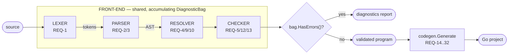

# CLAUDE.md

Guidance for Claude Code working in this repository.

**Status and history do not live here.** `.claude/state.md` is the resume
pointer — the next spec-task and the next issue, nothing more. Per-spec status
lives in each spec's own task tracking; open defects in
`.claude/issues/open-issues.md`. Read the pointer before starting work.

## What is being built

A **two-stage transpiler for DomainScript**. The front-end turns source text
into a validation verdict — a validated AST plus a diagnostics report; it
answers *"is this correct?"*. The back-end consumes that validated program and
emits a complete, idiomatic, compilable Go project; it answers *"here is the Go
code that does this."* A shared, accumulating `DiagnosticBag` runs across the
front-end stages; the back-end runs only when the bag has no errors.



- **RESOLVER**, three passes: type/ref resolution (REQ-4) → names in executable
  bodies (REQ-9) → config refs (REQ-10).
- **CHECKER**: the §23 rules (REQ-5) plus member access (REQ-12) and type
  compatibility (REQ-13) over a shared `types.Model`. The order is deliberate —
  an unresolved name becomes `types.ErrorType` downstream, so it never spawns a
  second type diagnostic (anti-cascade, NFR-9).
- **Program aggregation** (REQ-7) sits between PARSER and RESOLVER: parse every
  file, merge the ASTs into one program model, then resolve globally. The
  cross-file rules cannot run file-by-file.
- **Back-end output** is a real Go project: `go.mod`, a vendored `runtime/`
  package, one Go package per domain module, `contracts/` for shared
  `PublicEvent`s, one `cmd/<service>/` per service in the topology (a single
  default group when there is no topology).

## The language spec

`.claude/steerings/domainscript-spec-v7/` — one file per section, indexed by
its `README.md`. **Load only the sections your task needs**, not the whole spec.

### The spec is the source of truth — always

Nothing gets implemented that the spec does not describe, and nothing the spec
describes gets implemented in a different shape because the other shape is
easier. This binds in both directions:

- **Code diverges from the spec → the code is wrong.** Fix the code, never the
  spec, and never "accept both" (keeping the old spelling as a synonym leaves
  half the surface unspecified — it is the same violation, just quieter).
- **Something is implemented that the spec never describes → remove it**, or
  file an issue arguing it belongs in the spec and wait for the spec to say so.
- **A spec rule proves bad, ambiguous or incomplete mid-task → stop and file an
  issue** (`issue-generator` skill) stating what cannot be implemented as
  written and what the spec must decide. Do not guess a semantics to keep
  moving, and do not encode the guess in code "for now". Implement after the
  spec is revised, against the revised text.

`.claude/steerings/review-v7.md` is the standing audit of the implementation
against v7: what is missing, what diverges, and what exists outside the spec.
Read it before planning conformance work.

⚠️ **`§N` in this repo's code and specs follows v6 numbering and does not
reliably match the v7 filenames.** v7 inserted sections, so from roughly §20
onward the numbers shift (+2 in every case checked). Resolve a citation by
*section title*, never by number alone. Verified pairs: §23 regras de
compilação → `25-compilation-rules.md`; §22 testing `*.test.ds` →
`24-testing.md`; §20 Smart Partial Loading → `22-smart-partial-loading.md`.

## Where things live

```
.claude/state.md          resume pointer — next spec-task + next issue, only
.claude/specs/<spec>/     requirements.md, design.md + task tracking (see below)
.claude/issues/           one file per open issue; open-issues.md indexes them
.claude/steerings/        ambient reference docs (the language spec)
.claude/agents/           subagent definitions — the operative detail on who does what
.claude/hooks/            guard scripts referenced by agent frontmatter
.claude/skills/           spec-creator scaffolds a spec, issue-generator files an
                          issue; the rest are Go style references
```

**Two task-tracking models, both in use.** Legacy: a single `tasks.md` per
spec. Current, and what `spec-creator` scaffolds: one `tasks/<task-code>.md`
per task plus that spec's own `state.md` indexing pending/blocked. Mark a task
done in whichever model its spec uses — check the box in `tasks.md`, or set
`status: completed` in the task file and drop it from the spec's `state.md`.

**Which specs exist, what each covers and where each stands**: list
`.claude/specs/*/` and read its `requirements.md` and task tracking. That is
authoritative; this file deliberately keeps no spec index, because one goes
stale. `.claude/specs/codegen/gaps.md` records what the language spec promises
and the transpiler does not yet deliver.

Specs are written in **Portuguese**. Work is maintenance and extension, not
greenfield: a task cites the REQ it satisfies (`(REQ-n)`) and the design section
(`(§design x)`). Do not invent architecture that contradicts `design.md` — if a
change is needed, update the spec.

## Execution rules

- **One task at a time.** Never start a second before the current one is
  committed. Pick it up from `.claude/state.md`.
- **Keep `.claude/state.md` lean.** Exactly two pointers — next spec-task, next
  issue — overwritten in place, never appended: no per-spec table, no history,
  no running log. The spec-task pointer advances mechanically as work
  completes; the issue pointer is a manual priority call.
- **Errors found mid-task.** In scope of the current task → fix it here. Out of
  scope (another spec/task, pre-existing code) → register it with the
  `issue-generator` skill and keep going. If it *blocks* the current task, stop
  and report — do not work around it.
- **Anything the language spec doesn't cover → issue, never code.** A task that
  asks for what the spec doesn't describe, asks for it in a different shape, or
  needs a decision the spec never made, is blocked: file the spec-revision
  issue, mark the task `blocked`, stop. See "The spec is the source of truth".
- **Finishing a task.** Update the spec's own task tracking → overwrite the
  spec-task pointer with whatever comes next (this spec's next pending task, or
  another spec's if this one has none left) → commit.
- **One branch and one PR per spec.** `claude/impl-<spec-slug>`, cut from
  `main`, carrying one atomic commit per completed task. The first completed
  task creates the branch and opens the PR; every later task adds a commit, so
  each task's diff is still validated by CI on its own commit. When every task
  is done, comment `SPEC FINALIZADA` on the PR.
- **Never run the full suite locally.** `go test ./...`, `go vet ./...`, `make
  test` and `make lint` are CI's job, on the PR — including at spec closure. If
  you run tests at all, run only those that validate the current task
  (`go test ./parser/ -run TestX`).
- **Refine tasks at spec-creation time** — small, independently verifiable,
  vertically sliced — so execution never re-plans mid-spec.

**Who does what.** `.claude/agents/` holds the operative definitions. The
`.claude/hooks/` guards enforce the *mechanical* limits structurally (who may
run tests, who may write where); spec conformance is semantic, so it binds by
prompt only — every agent below carries it, and it is the one limit no guard
can catch for you.

- `spec-writer` — authors a spec. Never touches code, never runs tests.
  Specifies only what the language spec describes; anything beyond it becomes a
  spec-revision issue and the requirement is left out.
- `task-implementer` — executes exactly one task and commits it. **Never runs
  tests**: the spec's PR is its only test feedback. A blocker becomes a
  registered issue plus a `blocked` task, never a workaround — and a task that
  diverges from the language spec *is* a blocker.
- `spec-implementer` — drives a whole spec by dispatching `task-implementer`
  one task at a time, advancing only after the previous task's commit exists on
  the spec branch. Pure orchestrator: never edits code, never runs tests. Never
  re-dispatches a task blocked on a spec decision — no rewording produces the
  decision.
- `issue-registrar` — proves a suspected defect is real, then files it. **The
  only agent that runs tests**, and it files nothing when the problem does not
  reproduce. It never fixes what it finds: repro work happens in a copy outside
  the repository, and the versioned tree stays untouched. Also files the two
  spec-conformance kinds: behaviour implemented outside the spec, and gaps or
  contradictions in the spec itself.

## Architecture invariants

Load-bearing decisions — violating them breaks the design's core promises.

- **Hard syntax/semantics split (NFR-6).** The parser knows *zero* §23 semantic
  rules; it accepts everything grammatically well-formed, including
  semantically impossible programs (primitive in Write Side, non-exhaustive
  `match`, `Nop` in Handle). The semantic phases never re-tokenize or re-parse.
  The *only* contract between phases is `(AST, DiagnosticBag)`.
- **The parser never returns `nil`.** On syntax error it emits typed error nodes
  (`ErrorDecl`/`ErrorStmt`/`ErrorExpr`) implementing the normal interfaces.
  Later phases skip subtrees containing one, so a syntax error never becomes a
  false semantic error (REQ-2.7, REQ-4.5).
- **Hand-written recursive-descent parser** (no generator) — total control over
  error messages and recovery (REQ-3, NFR-1). Recovery mechanics are specified
  in `transpilador/design.md` §3.5; read it before touching them. Two rules
  bind from outside: `synchronize` never consumes the stop token or a closing
  `}`/EOF (the enclosing level closes its own block), and every parse loop
  guarantees cursor progress (NFR-2).
- **Dependencies point "downward"**: `driver → sema → resolver → parser → lexer
  → ast/token/diag`. One package per responsibility.
- **Determinism (NFR-3).** Same input → identical diagnostics in identical
  order. Ordering by `(line, col)` happens only at render time, which is what
  lets syntax and semantic diagnostics merge.

### Back-end

- **Core vs. opt-in dependencies (NFR-12).** The transactional core (in-memory
  event store, dispatcher, unit of work, `net/http` edge) depends on the Go
  stdlib and the vendored `runtime/` only. A real DB driver, gRPC or
  OpenTelemetry enter `go.mod` **only** when the program declares them — a
  `Database` whose provider `codegen/sql_wiring.go` recognizes as real
  (`"sqlite"`, `"postgres"`), an `Interface GRPC`, a `Telemetry` block — always
  behind an interface. Any other provider label (e.g. `"pg"`, an inert
  placeholder in several fixtures) stays decorative and pulls nothing.
- **The generator never re-lexes/re-parses/re-validates.** Its only inputs are
  `program.Program`, `symbols.SymbolTable` and a `types.Model`; it refuses to
  run when the program's `DiagnosticBag` has errors (REQ-14.1).
- **Determinism (NFR-13).** Regenerating the same program is byte-identical
  (stable ordering of declarations, imports, map members and files) and
  idempotent into a populated output directory — unchanged files are not
  rewritten, files orphaned by a removed declaration are deleted.
- **Golden test + smoke compile, paired (NFR-17).** Every emitter has a golden
  test; on top of that the fixture projects (`testdata/projects/wallet`,
  `shop`) are generated via `GenerateProject` and built over the bytes actually
  written to disk — a golden test alone does not prove the output compiles.

## Examples vs. fixtures — two directories, two jobs

Keep these apart; conflating them is what let the implementation's spelling
leak into the teaching material in the first place.

- **`docs/examples/`** — written against the **spec**, one example per area
  (§2/§3, §4, §5/§6, …). They exist to show what the language can do, and they
  **do not compile today** — on purpose. They are the conformance target.
  Never "fix" one by retreating to a form the transpiler happens to accept;
  that inverts the source of truth. No CI job validates them.
- **`testdata/projects/`** — written against **what the transpiler accepts
  today**, read from disk by tests in `driver/`, `codegen/`, `codegen/lower/`
  and `codegen/goname/`, and swept by the `fixtures` CI job (`dsc check` +
  `dsc gen` + `go build`/`go vet`). Their job is catching regressions, so they
  may legitimately contain non-spec forms (the `ok` sentinel, the `value`
  receiver). Editing a `.ds` here changes generated Go and breaks the matching
  golden — intended when deliberate, a useful alarm when not.

A new language feature lands in `docs/examples/` when the **spec** describes
it, and in `testdata/projects/` when the **implementation** ships it. Those are
different moments, and the gap between them is the point.

## Package layout

```
cmd/dsc/        CLI: "check" and "gen" subcommands (REQ-8, REQ-32)
token/          TokenKind, Token, Pos (1-based), keywords
diag/           Diagnostic, Severity, DiagnosticBag (dedup, cap=100, render); codes E1xx
lexer/          single-pass over []rune (REQ-1)
ast/            Node/Decl/Stmt/Expr interfaces, Span, error nodes
astutil/        generic AST traversal shared by resolver & sema (NFR-8)
parser/         cursor, expect, synchronize, sync_sets, parse_{decl,stmt,expr,config,test}
symbols/        SymbolTable, per-module scope + public level
resolver/       symbol collection + name resolution (REQ-4/9); config refs (REQ-10)
types/          Type model, TypeOf/Members catalog, expr inference, Assignable (REQ-11)
sema/           checker + rules_{types,flow,domain,program,warnings} (REQ-5),
                rules_typecheck (REQ-12), rules_compat (REQ-13)
program/        aggregates files into a unified model (REQ-7)
driver/         pipeline orchestration + public API (REQ-8); GenerateProject (REQ-32)
codegen/        back-end orchestrator: Generate(prog, model, opts) → []File (REQ-14)
codegen/emit/   Go emitter: buffer, managed imports, gofmt via go/format (REQ-15)
codegen/lower/  lowering of Expr/Stmt/Block → Go, incl. TypeEnv (REQ-22)
codegen/rtsrc/  vendored runtime source (event store, dispatcher, UoW, …), embedded (REQ-16)
codegen/*rt/    opt-in adapters (grpcrt, otelrt, sqlrt, amqprt, redisrt, s3rt) —
                emitted only when the program declares that infrastructure
```

Public API: `driver.CheckSource(src) (*ast.File, *diag.DiagnosticBag)`,
`driver.CheckProject(dir) (*program.Program, *diag.DiagnosticBag)`,
`driver.GenerateProject(dir, out, codegen.Options) (*diag.DiagnosticBag, error)`.

## Commands

Go module named `domainscript`; a `Makefile` wraps `build`/`test`/`lint`/`fmt`.
Note that `make test` is `go test ./...` and `make lint` is `gofmt` + `go vet
./...` — both are the full suite, so both are CI's job.

```sh
go build ./...                        # build all packages
gofmt -l .                            # list unformatted files
go test ./parser/ -run TestRecovery   # one package / one test by regex
dsc gen <dir> -o <out>                # validate <dir> and generate a Go project
```

## Conventions

- **Slice vertically.** Implement one construct end-to-end (lexer → parser →
  semantics → test) before widening to the next. Follow the task order; it
  respects dependencies.
- **Every §23 rule needs a positive *and* a negative test** — a program that
  violates it (expecting the exact diagnostic) and a correct one (expecting
  silence). This pairing is the central Definition of Done (NFR-4).
- **Green tree before commit**: `go build ./...` passing, one atomic commit per
  completed task.
- **Conventional Commits**, Portuguese imperative, e.g. `feat(parser):
  declaração Aggregate`. Types: `feat`/`test`/`refactor`/`chore`/`docs`/`fix`.
  Scope is the package or area touched — `codegen` and `repo` dominate today,
  alongside `lexer`/`parser`/`ast`/`diag`/`sema`/`resolver`/`symbols`/`types`/
  `program`/`cli`/`docs`/`issues`.
