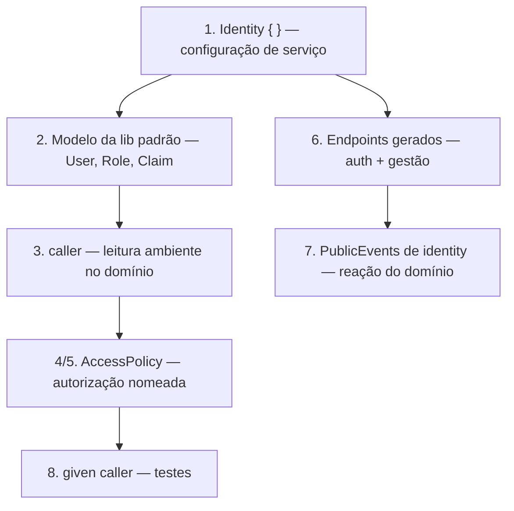

# Identity — superfície de API para o desenvolvedor

> Status: **proposta de design**. Continuação de [[Identity]], que fixa o
> *porquê* e as decisões de arquitetura; este documento fixa *o que o
> desenvolvedor escreve*. Exemplo aplicado em [[Identity-Exemplo-Pizzeria]].
> Nada disto existe na spec ou no transpilador ainda.

## 1. O princípio da superfície

Em ASP.NET Core Identity o desenvolvedor programa contra **objetos injetados**:
`UserManager<TUser>`, `RoleManager<TRole>`, `SignInManager<TUser>`, e um
`IdentityUser` que ele herda e estende. Isso é natural em C# e é exatamente o
que **não** cabe aqui: DomainScript não tem injeção de dependência, não tem
herança, e o domínio nunca recebe infraestrutura ([[Identity]] §2).

A tradução do mesmo poder para os idiomas que a linguagem já tem:

| Conceito | ASP.NET Core Identity | Keycloak | Cognito | DomainScript |
|----------|----------------------|----------|---------|--------------|
| Configuração | `AddIdentityCore` + `*Options` | realm | user pool | bloco `Identity` (§2) |
| Modelo do usuário | `IdentityUser` herdado | user + attributes | user + attributes | `User` da lib padrão, **não** herdável (§3) |
| Criar/alterar usuário | `UserManager<T>` | Admin REST API | `AdminCreateUser` | API de gestão gerada (§6) |
| Papéis | `RoleManager<T>` | realm/client roles | groups | sementes declaradas + API (§3.3) |
| Login | `SignInManager<T>` | token endpoint | `InitiateAuth` | endpoints `login`/`refresh` (§6) |
| Autorizar por papel | `[Authorize(Roles=…)]` | role mapping | group check | `caller.hasRole(Role.x)` (§4) |
| Autorizar por política | `[Authorize(Policy=…)]` | policies/scopes | — | `AccessPolicy` (§5) |
| Dono do recurso | `IAuthorizationHandler` custom | — | — | `AccessPolicy` com `self` (§5) |
| Mapear claims | claims transformation | protocol mappers | pre-token lambda | `claims { }` (§2) |
| Login social | external providers | identity brokering | federation | `external X { }` (§2) |
| Conta de máquina | client credentials | service accounts | app clients | `serviceAccounts { }` (§2.2) |
| Reagir a cadastro | eventos/`IUserClaimsPrincipalFactory` | event listener SPI | Lambda triggers | `Policy … on UserRegistered` (§7) |

São **sete superfícies**, e o desenvolvedor não escreve uma linha de código
imperativo em nenhuma delas.



## 2. Superfície 1 — o bloco `Identity`

Declarado no nível do `service` em `topology.ds` ([[Identity]] §3.4). A forma
completa, com todos os blocos opcionais visíveis:

```ds
Identity {
    provider: local                      // local | oidc | federated

    // O store é declarado AQUI, não num mod.ds: Identity é de serviço, e
    // módulo nenhum é dono dele. Mesmas chaves de um Database de módulo.
    store {
        provider: "postgres"
        connection: env("IDENTITY_DB_URL")
        tenancy: { strategy: row_level, column: "tenant_id" }
    }

    id: User                             // ref T de caller.id — §3.2

    // obrigatório em local/federated: o serviço não sobe sem root (§2.3)
    root {
        email:    env("IDENTITY_ROOT_EMAIL")
        password: env("IDENTITY_ROOT_PASSWORD")
    }

    password     { hasher: argon2id, minLength: 12, requireDigit: true }
    lockout      { maxAttempts: 5, window: 15min, duration: 15min }
    tokens       { access { ttl: 15min }, refresh { ttl: 30d, rotation: true } }
    confirmation { email: required }
    mfa          { totp: optional }

    roles  { customer, manager, cook }   // sementes — §3.3
    claims { storeUnit, tier }

    serviceAccounts { … }                // §2.2
    expose { … }                         // §6
}
```

`provider: oidc` troca `store`/`password`/`lockout`/`tokens` por
`issuer`/`audience`/`jwks`/`claims`, e não gera endpoint nenhum
([[Identity]] §3.2). Declarar um bloco fora do provedor a que ele pertence é
erro de compilação, não configuração ignorada.

### 2.1. Sementes: o que declarar é *citar*, não *fechar*

`roles { customer, manager, cook }` declara os papéis que **o código deste
programa cita**. Cada nome vira um valor de `Role` referenciável —
`Role.manager` — verificado em compilação. O catálogo real vive no store e é
mutável pela API de gestão ([[Identity]] §4.4): o cliente cadastra os papéis
dele, que existem, valem e autorizam — só não podem ser citados por nome numa
`AccessPolicy`, porque não haveria contra o que checá-los.

Mesma coisa para `claims { }`: declara as chaves que o código lê com
`caller.hasClaim(Claim.storeUnit, v)`.

### 2.3. `root` — o bootstrap, no modelo do Keycloak e do Postgres

Mutar o catálogo de papéis é criar autoridade nova. Isso não pode depender de
o desenvolvedor lembrar de proteger um endpoint, então não é configurável:

- **`Role.root` é da lib padrão**, sempre existe, não é removível e não é
  atribuível pela API por ninguém que já não seja root.
- **O bloco `root { }` é obrigatório** com `provider: local` ou `federated`, e
  proibido com `oidc` (lá o admin é do provedor externo). Sem ele, **erro de
  compilação**; com as variáveis vazias em runtime, **o serviço não sobe** —
  fail-closed, como um Postgres sem `POSTGRES_PASSWORD`.
- **Criado uma única vez**, na primeira subida em que o store não tem nenhum
  root. É idempotente: reiniciar não recria, e **mudar a variável depois não
  sobrescreve a senha** — mesma semântica de `KEYCLOAK_ADMIN` e
  `POSTGRES_PASSWORD`, e pela mesma razão (a env é semente de bootstrap, não
  fonte de verdade contínua).

A separação de poderes que isso permite tem dois níveis, e é o que evita que
"só root faz tudo" vire "todo mundo é root na prática":

| Operação | Quem pode |
|----------|-----------|
| Criar, alterar ou remover **papel/claim do catálogo** | Só `root`. Não delegável, não configurável |
| Criar usuário e atribuir **papel existente** | Delegável por `expose { users { requires … } }` (§6) |

Ou seja: o gerente da pizzaria cria cozinheiros o dia inteiro sem nunca poder
inventar um papel novo. Perfil novo é ato de root.

**Superfície da credencial.** Senha em variável de ambiente é o padrão da
indústria (Postgres, Keycloak, MySQL) e tem o custo conhecido: vaza em `ps`, em
dump de env, em log de orquestrador. A variável deve apontar para um secret
manager onde o ambiente tiver um.

### 2.3.1. Ciclo de vida do root

```ds
root {
    email:    env("IDENTITY_ROOT_EMAIL")
    password: env("IDENTITY_ROOT_PASSWORD")
    lockAfterBootstrap: true          // default; false em dev
}
```

**`lockAfterBootstrap` é configurável, e o default é `true`** — coerente com o
fail-closed do princípio 4 de [[Identity]] §2, e seguro porque a recuperação
abaixo existe. O gatilho precisa ser determinístico: **root é travado assim que
cria o primeiro usuário com sucesso**. Depois disso ele não autentica mais, e o
sistema segue nas mãos do administrador que ele acabou de criar — que é o
ponto. Em desenvolvimento, `false` evita o ciclo de destravar a cada
`docker compose up`.

**Recuperação: re-bootstrap, no modelo do Keycloak.** Nem reset da conta
existente, nem senha mestra — um root **temporário**, criado sob pedido
explícito:

| | Comportamento |
|---|---|
| Boot normal, root já existe | Env ignorada — semente não sobrescreve (§2.3) |
| Boot com `IDENTITY_BOOTSTRAP_ROOT=true` | Cria um root **temporário** com as credenciais da env, ao lado do existente |
| Enquanto o root temporário existir | ⚠️ WARN em todo boot, e a conta aparece marcada na listagem de usuários |
| Depois de recuperar o acesso | O operador remove o temporário explicitamente |

É o `KC_BOOTSTRAP_ADMIN_*` / `kc.sh bootstrap-admin` do Keycloak 26, com a
mesma propriedade que o torna aceitável: recuperar exige **acesso ao ambiente
de deploy**, não conhecimento de um segredo permanente — quem pode setar env e
reiniciar o serviço já podia trocar o binário.

Uma consequência de arquitetura: isso é lido pelo binário gerado em
`cmd/<service>`, no boot, não pelo `dsc`. O compilador não roda em produção, e
recuperação é operação de runtime.

### 2.2. O principal que não é gente

Uma `Policy` que reage a um `PublicEvent` dispara `Handle`s protegidos por
`access`. Quem é o `caller` ali? Hoje o fixture `pizzeria` responde com
`caller.hasRole("system_sales")` e nunca diz quem atribui esse papel — é
exatamente o buraco que [[Identity]] §1 descreve.

**Decisão: o caller é o próprio módulo/serviço que disparou** ([[Identity]]
§4.5). Todo módulo tem um principal, sem declaração nenhuma: ele existe porque
o módulo existe. Daí a forma canônica de autorizar execução reativa não é papel
inventado, é o nome do módulo:

```ds
AccessPolicy SalesSystem   { requires caller.isService(Sales) }
AccessPolicy KitchenSystem { requires caller.isService(Kitchen) }
```

Isso apaga metade da necessidade de `system_*`: `system_sales`,
`system_kitchen` e afins eram nome de convenção para algo que o compilador
sabe sozinho — qual módulo está executando. Papel para isso é indireção sem
ganho, e uma `string` a mais para digitar errado.

Sobra o caso que **não** é módulo deste sistema: a máquina externa. O gateway
de pagamento batendo em `/admin/orders/{id}/pay` não tem principal implícito,
precisa de credencial e de papéis:

```ds
serviceAccounts {
    Payments { roles: [system_payment], credentials: clientSecret }
}
```

É o "service account" do Keycloak e o "app client" do Cognito, agora restrito
ao caso em que ele é de fato necessário: parar de tratar sistema externo como
usuário sem credencial. Chamador interno não declara nada.

## 3. Superfície 2 — o modelo da lib padrão

Fecha o residual R4 de [[Identity]] §9.1. Tudo aqui é **implementação interna
do compilador**: o desenvolvedor referencia, popula e configura; não escreve,
não herda, não versiona.

### 3.1. Tipos

```ds
// --- lib padrão, não escrito pelo desenvolvedor ---

ValueObject Email(string)          { Valid { … } }
ValueObject Password(string)       { Valid { … } }   // write-only: ver 3.4
ValueObject Role(string)           { Valid { … } }
ValueObject Claim(string)          { Valid { … } }
ValueObject ClaimValue(string)     { Valid { … } }
ValueObject ClaimAssignment        { key Claim, value ClaimValue }

Enum UserStatus : string {
    PendingConfirmation = "PENDING"
    Active              = "ACTIVE"
    Locked              = "LOCKED"
    Disabled            = "DISABLED"
}

Aggregate User {
    strategy EventSourced

    state {
        email  Email
        status UserStatus
        roles  List<Role>
        claims List<ClaimAssignment>
        tenant ref Tenant            // presente sob multi-tenancy — R1
    }
}
```

O que o desenvolvedor faz com isso: `ref User` em campos do domínio dele
(`Order.customerId`), `Role.manager` em políticas, `Claim.storeUnit` em
condições. Só.

`Role.root` já vem no catálogo (§2.3) e é o único nome reservado: redeclará-lo
em `roles { }` é erro, e ele nunca é criado nem atribuído pela API.

### 3.2. `id: T` — quem `caller.id` referencia

`Identity { id: User }` é o default: o principal é o `User` da lib padrão, e
`caller.id : ref User`. Quem modela o principal no próprio domínio escreve
`id: Customer`, e `caller.id : ref Customer` ([[Identity]] §4.3). A escolha é
por serviço e não muda uma linha de policy — muda o tipo que o compilador
verifica do outro lado do `==`.

### 3.3. Eventos que a lib padrão publica

`PublicEvent`s de verdade: o domínio reage a eles com a `Policy` de sempre
(§7), sem mecanismo novo.

```ds
PublicEvent UserRegistered { id ref User, email Email }
PublicEvent UserConfirmed  { id ref User }
PublicEvent RoleAssigned   { id ref User, role Role }
PublicEvent RoleRevoked    { id ref User, role Role }
PublicEvent UserLocked     { id ref User }
PublicEvent UserDisabled   { id ref User }
PublicEvent SignInFailed   { id ref User }
```

### 3.4. O que a lib padrão **não** deixa fazer

A lista importa tanto quanto a de cima, porque é ela que impede o
`IdentityUser` estendido de voltar pela janela:

| Tentativa | Resultado |
|-----------|-----------|
| `Aggregate User { … }` no código do desenvolvedor | ❌ Erro — nome reservado |
| Ler `Password` em qualquer posição (state, View, evento) | ❌ Erro — só entra, nunca sai |
| `load User(x)` num UseCase do desenvolvedor | ❌ Erro — identity não é agregado do módulo dele (§6) |
| Adicionar campo a `User` | ❌ Erro — o lugar disso é `claims { }`, ou um agregado do domínio dele |
| `View UserVW From User` | ❌ Erro — a leitura de identity é pelos endpoints gerados |
| `caller.id` fora de `access`/`visibility`/`AccessPolicy`/UseCase | ❌ Erro (§4.1) |
| Criar, atribuir ou remover `Role.root` pela API | ❌ Erro — root vem do bootstrap (§2.3) |
| Mutar o catálogo de papéis sem ser root | ❌ `403` em runtime, não configurável |

O terceiro item é o que preserva o isolamento de módulo: Identity é serviço,
não módulo do desenvolvedor, então `load` cruzaria uma fronteira que a
linguagem não permite cruzar. A porta para escrever em identity é a API de
gestão (§6), como o Admin REST API do Keycloak — não uma chamada de dentro do
domínio.

## 4. Superfície 3 — ler o principal no domínio

Contrato completo em [[Identity]] §4. O que o desenvolvedor escreve:

```ds
caller.authenticated              // boolean
caller.id                         // ref T
caller.hasRole(Role.manager)      // boolean
caller.hasClaim(Claim.storeUnit, "centro")
caller.satisfies(OrderOwner)
caller.isService(Sales)           // principal implícito de módulo — §2.2
```

### 4.1. Onde `caller` é legível

`access`, `visibility`, `AccessPolicy` — e **o corpo do `UseCase`**
([[Identity]] §4.5). Sem a última posição não haveria como gravar o dono de um
recurso, e o principal teria que chegar pelo payload do Command:

```ds
UseCase PlaceOrder handles Place {
    execute {
        order.Place(customerId: caller.id, …)     // ambiente, não payload
    }
}
```

O `Handle` continua recebendo `customerId` por parâmetro e permanece testável
sem principal nenhum — `caller` dentro de `Handle` segue proibido. E o
princípio 1 de [[Identity]] §2 fica de pé: o valor vem do contexto ambiente,
`cmd.customerId` continua sendo o erro que sempre foi.

**Ler não é autorizar.** Com `caller` disponível no UseCase, nada impede
escrever `ensure caller.hasRole(Role.manager) else Forbidden` no corpo — e aí
a autorização vira invisível para o compilador, contra a Forma Canônica de
[[Identity]] §2. A decisão de acesso pertence a `access`, `requires` e
`AccessPolicy`, que são declarativos e inspecionáveis; o UseCase lê `caller`
para *alimentar o domínio*, não para decidir permissão. Proponho aviso
(⚠️ warning), não erro — ver §9, Q1.

## 5. Superfície 4 — `AccessPolicy`

Sintaxe e semântica em [[Identity]] §5. O que este documento acrescenta é
**onde cada policy é declarada**, que a decisão de serviço tornou uma pergunta
real:

| Policy | Onde é declarada | Visível para |
|--------|------------------|--------------|
| Só `caller` (sem `self`) | Escopo de serviço — `access.ds` na raiz do projeto | Todos os módulos do serviço |
| Referencia `self` | Módulo do agregado que ela protege | Aquele módulo |

O critério é o mesmo que decide onde a policy *executa* ([[Identity]] §5.1):
sem `self` é borda e vale para o serviço inteiro; com `self` é domínio e
pertence ao agregado. Papel é conceito do serviço (o `Identity` é um só), posse
é conceito do agregado.

Uso nas três posições:

```ds
Aggregate Order    { access     { ConfirmPayment requires Manager } }
View OrderVW …     { visibility { total requires OrderVisible } }
Interface HTTP     { POST "/admin/menu" -> CreateMenuItem { requires Manager } }
```

A terceira é a que faltava: `requires` na rota é a autorização de borda do
caso "acessar o recurso no path X com o token Y", que não toca domínio e
rejeita antes do UseCase.

## 6. Superfície 5 — endpoints gerados

`expose` é opt-in por item, e **cada item carrega a sua própria política** — é
aqui que mora o `UserManager`/`RoleManager` do ASP.NET, como HTTP em vez de
objeto injetado:

```ds
expose {
    register      { public, roles: [customer] }       // §6.1
    login         { public }
    refresh       { public }
    logout        { requires caller.authenticated }
    confirmEmail  { public }
    resetPassword { public }
    manage        { requires caller.authenticated }   // perfil, senha, 2FA do próprio
    users         { requires Manager, roles: [cook] } // gestão de terceiros
    roles         { }                                 // catálogo — root, implícito (§2.3)
}
```

### 6.1. O papel vem da request, dentro de um allowlist

Não existe papel default: **a request diz qual papel está criando**, e omiti-lo
é `400`.

```http
POST /identity/register   { "email": "ana@x.com", "password": "…", "role": "customer" }
POST /identity/users      { "email": "joao@x.com", "role": "cook" }
```

Só que "a request escolhe" sozinho seria escalada de privilégio na primeira
tentativa — `register` é público, e nada impediria `"role": "manager"`. Por
isso o `roles:` do `expose` é o **conjunto que aquele endpoint pode criar**:

| Situação | Resultado |
|----------|-----------|
| `role` ausente na request | `400` — não há default a assumir |
| `role` fora do `roles:` do endpoint | `403` — inclusive para quem passou no `requires` |
| `register` ou `users` sem `roles:` declarado | ❌ Erro de compilação |
| `roles: [root]` em qualquer endpoint | ❌ Erro de compilação — root não se cria pela API (§2.3) |

As duas metades são necessárias: explícito na request tira o default
implícito, e o allowlist tira a escolha livre. Um `Manager` com
`users { requires Manager, roles: [cook] }` cria cozinheiros e nada mais — nem
outro gerente, nem root.

| Item | Rotas | Equivalente |
|------|-------|-------------|
| `register` | `POST /identity/register` | `UserManager.CreateAsync` |
| `login` | `POST /identity/login` | `SignInManager.PasswordSignInAsync` |
| `refresh` | `POST /identity/refresh` | refresh token flow |
| `logout` | `POST /identity/logout` | `SignInManager.SignOutAsync` |
| `confirmEmail` | `POST /identity/confirm-email` | `ConfirmEmailAsync` |
| `resetPassword` | `POST /identity/forgot-password`, `/reset-password` | `GeneratePasswordResetTokenAsync` |
| `manage` | `GET\|POST /identity/manage/{profile,password,2fa}` | Identity UI /Manage |
| `users` | `GET\|POST\|PATCH /identity/users…`, `PUT\|DELETE /identity/users/{id}/roles/{role}`, `POST /identity/users/{id}/lock` | `UserManager` + `AddToRoleAsync` |
| `roles` | `GET\|POST\|DELETE /identity/roles`, `…/claims` | `RoleManager` (sempre root) |

Regras de borda: rotas de identity são `{ tenancy: none }` por construção
(precedem o tenant — [[Identity]] §7.2), herdam `basePath` e nascem com
`rateLimit { perIp: … }` default.

## 7. Superfície 6 — reagir a identity no domínio

O gancho que o Keycloak resolve com event listener SPI e o Cognito com Lambda
trigger. Aqui é a `Policy` de sempre, sobre um `PublicEvent` de sempre:

```ds
// e-commerce: todo usuário cadastrado vira também um cliente do domínio
Policy CreateCustomerOnUserRegistered on UserRegistered {
    delivery AtLeastOnce
    execute {
        customer = load Customer(event.id)
        ensure customer not exists else Nop
        Customer.Create(userId: event.id, email: event.email)
    }
}
```

É a ponte da §7.3 de [[Identity]] entre principal do serviço e usuário do
domínio, escrita sem nenhuma construção nova.

## 8. Superfície 7 — testes

Fecha o residual R3 de [[Identity]] §9.1, seguindo o Given-When-Then de
[[24-testing]]: o principal é mais um `given`.

```ds
Test OrderAccess {
    scenario "cozinheiro não confirma pagamento" {
        given caller User("U3") { roles: [cook] }
        given Order("O1") from [ OrderPlaced(id: "O1", customerId: "U1", …) ]
        when ConfirmPayment()
        then forbidden                       // 403 — autenticado, sem permissão
    }

    scenario "anônimo não faz pedido" {
        given caller anonymous
        when Place(…)
        then unauthorized                    // 401 — distinção da §7 de [[Identity]]
    }
}
```

`given caller User("U3") { roles: [cook], claims: { storeUnit: "centro" } }`
fixa o principal sem subir provedor, que é o princípio 6 de [[Identity]] §2.
`then forbidden` / `then unauthorized` é a asserção que hoje não existe —
[[23-error-classification]] só tem `ErrForbidden`.

## 9. Questões que esta proposta abre

Ainda no espírito de não codificar decisão que a spec não tomou:

1. **Q1 — autorização inline no UseCase (§4.1).** Decidido que `caller` é
   legível ali; falta decidir o que fazer quando alguém usa isso para
   *autorizar* em vez de alimentar o domínio. Proponho ⚠️ warning — erro seria
   difícil de definir sem falso positivo, e silêncio deixa autorização fora do
   alcance do compilador.
2. **Q2 — `caller.isService(M)` (§2.2).** A decisão de que o caller reativo é
   o módulo pede um membro novo no contrato de `caller`, que [[Identity]] §4
   ainda não lista. Alternativa seria papel implícito por módulo, que traz de
   volta a `string`.
3. **Q3 — `requires` em rota (§5).** Estende [[11-interface]]; precisa decidir
   se convive com o `access` do agregado (as duas checagens rodam) ou se uma
   suprime a outra. A proposta é que rodem as duas, fail-closed.
4. **Q4 — leitura de identity pelo desenvolvedor.** §3.4 proíbe `View … From
   User`. Uma tela de "meus dados" além do `manage` gerado exigiria alguma
   query da lib padrão — deliberadamente fora desta proposta.
5. **Q5 — cardinalidade principal ↔ tenant** (R1 de [[Identity]] §9.1) decide o
   tipo de `User.tenant` em §3.1. Com root no desenho ela ganha um caso
   concreto: root é global e atravessa tenants por definição, então a resposta
   precisa comportar um principal sem tenant.
6. **Q7 — vida útil do root temporário (§2.3.1).** Decidido que a recuperação
   cria um root temporário; falta decidir se ele expira sozinho (`recovery
   { ttl: 1h }`) ou só sai por remoção explícita, como no Keycloak. TTL fecha a
   janela de quem esqueceu de remover; remoção explícita é mais previsível.
