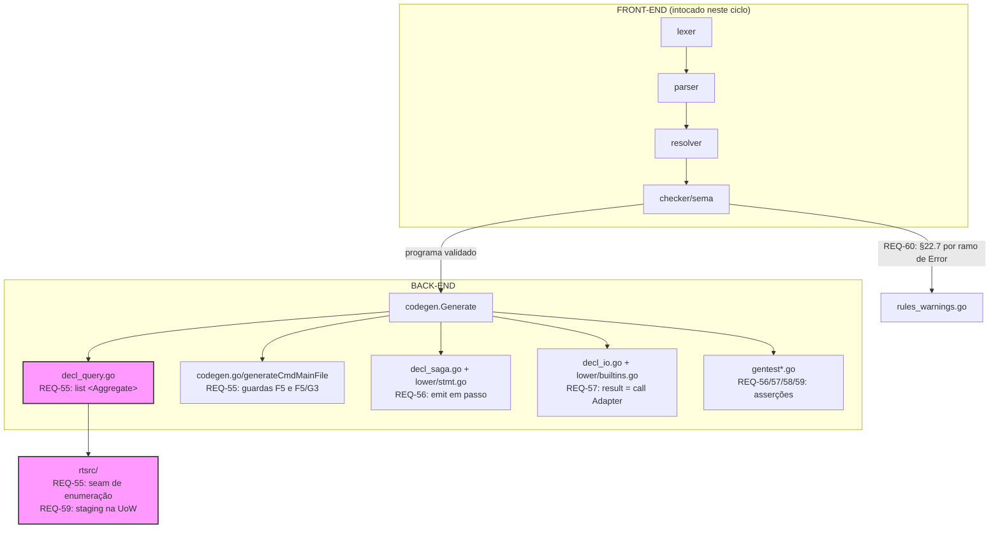
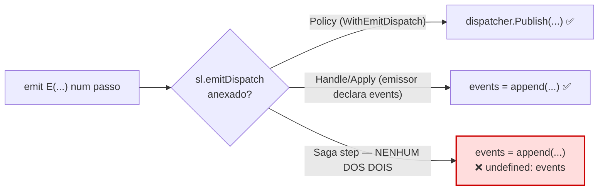
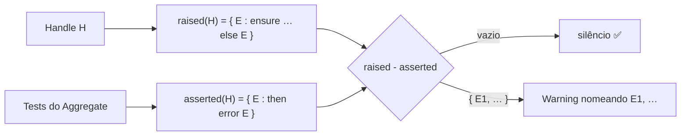
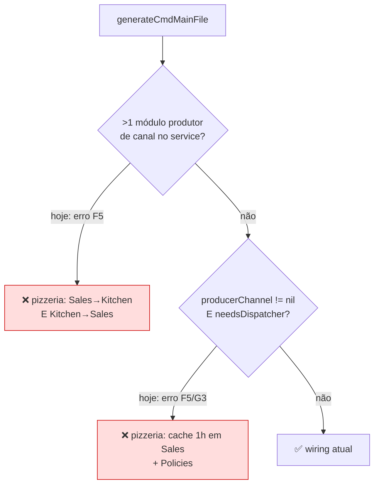
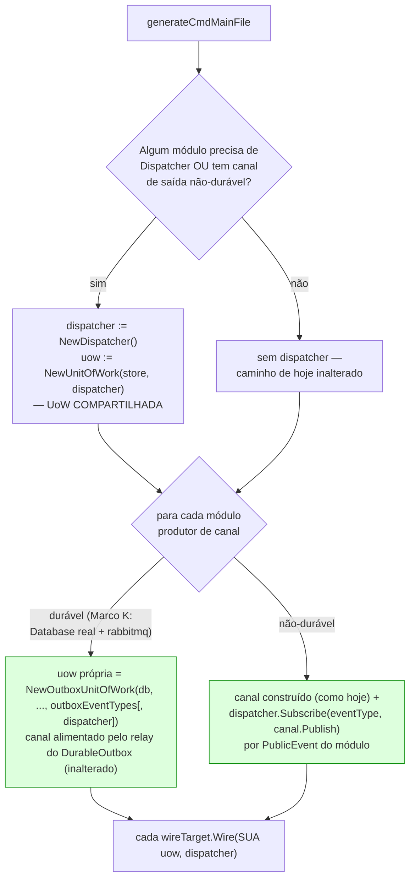

# Design — Conclusão das dívidas remanescentes (ISSUE-6, ISSUE-8, ISSUE-12)

> Define **como** atender [requirements.md](requirements.md) (REQ-55..61, NFR-31..33). Estende os
> designs do Marco I (Read Side), Marco H4 (`*.test.ds` → Go) e Marco L.
>
> **Diferença de método em relação ao Marco L:** toda análise de raiz abaixo foi
> confirmada por **leitura do código E reprodução**, antes de virar task. A §7
> registra o que foi verificado, como, e o que a verificação mudou.

## 1. Diretivas para o Agente (AI Instructions)

- Não invente estruturas de diretórios: tudo mora nos pacotes que já existem
  (`codegen/`, `codegen/lower/`, `codegen/rtsrc/`, `sema/`).
- **Diagramas em `mermaid`**, nunca ASCII art.
- **Antes de implementar, releia a seção de design referenciada no frontmatter
  da task.** Se o código divergir do que esta seção afirma, **pare e reporte** —
  não improvise um fix alternativo. Foi exatamente assim que o Marco L acumulou
  quatro tasks com premissa errada.
- **Nunca substitua um gap por Go que não compila.** Toda forma não suportada
  descoberta durante a execução vira erro de geração claro (NFR-33).

---

## 2. Visão Arquitetural

### 2.1. Onde o trabalho mora

Todo o ciclo é back-end, exceto REQ-60 (checker semântico). Nenhuma fase toca
léxico/parser — por construção: o que exigiria gramática nova foi delimitado
(REQ-61).



### 2.2. Invariantes preservados

- **O gerador nunca re-lexa/re-parseia/re-valida** (REQ-14.1): entradas são só
  `program.Program`, `symbols.SymbolTable` e `types.Model`.
- **Determinismo (NFR-13):** regenerar o mesmo programa é byte-idêntico. Vale
  para a enumeração de streams (**ordem estável**, ver §5.1) e para o shrinking
  (semente fixa, §4.5).
- **Núcleo do runtime sem deps externas (NFR-12/32):** `rtsrc/` é stdlib pura.
- **A interface `runtime.EventStore` não muda** (NFR-32): a enumeração entra
  como interface **opcional**, descoberta por type assertion — `sqlrt.EventStore`
  e os dublês de teste em `codegen/*_test.go` continuam compilando intocados.
- **Fronteira de spec é parada, não adivinhação:** `released`, acesso NEGADO,
  §4.4 e §25 são delimitados (REQ-61), nunca inventados.

---

## 3. Estrutura de Pacotes (Delta)

```text
codegen/
├── decl_query.go          # + tryEmitListAggregate (REQ-55.3/55.4)
├── codegen.go             # guardas F5 e F5/G3 → wiring suportado (REQ-55.7/55.8)
├── decl_saga.go           # + detecção de emit em passo (REQ-56.1) e a rota de §4.3
├── decl_io.go             # Call<Nome> com valor de retorno (REQ-57.2)
├── gentest.go             # emitSagaThenAssert "emitted", emitSagaMock, rolledback
├── gentest_property.go    # shrinking determinístico (REQ-58)
├── lower/
│   ├── stmt.go            # + hoistListAggregate (REQ-55.4)
│   ├── env.go             # ItemTypeOf para "list <Aggregate>" (REQ-55.3)
│   └── builtins.go        # QueryExpr.Op "call" deixa de ser erro (REQ-57.2)
└── rtsrc/
    ├── eventstore.go.txt  # + StreamLister opcional + impl in-memory (REQ-55.1/55.2)
    └── uow.go.txt         # staging em memoryTx (REQ-59)

sema/
└── rules_warnings.go      # cobertura §22.7 por ramo de Error (REQ-60)

.github/workflows/ci.yml   # pizzeria sai de KNOWN_UNGENERATABLE (REQ-55.10)
../codegen/gaps.md   # delimitações e reclassificações (REQ-61)
```

**Direção de dependências (inalterada):** `driver → sema → resolver → parser →
lexer → ast/token/diag`; `codegen` depende de `program`/`symbols`/`types` e
nunca o contrário. `codegen/rtsrc/` é fonte vendorizada — não importa nada de
`codegen`.

---

## 4. Componentes e Contratos

### 4.1. Seam de enumeração de streams (Atende REQ-55.1/55.2)

**Análise de raiz (verificada).** `runtime.EventStore` tem exatamente dois
métodos, ambos por `aggregateID`:

```go
type EventStore interface {
    Append(ctx context.Context, aggregateID string, events []Event) error
    Load(ctx context.Context, aggregateID string) ([]Event, error)
}
```

Não há **nenhuma** primitiva de enumeração — nem por tipo de Aggregate, nem em
geral. `memoryEventStore.streams` é um `map[string]*tenantStream` chaveado por
`aggregateID`; o `tenantStream` guarda o tenant, **não** o tipo do Aggregate. Ou
seja, `list <Aggregate>` não tem como ser gerado hoje nem em princípio: falta a
informação e falta o método.

**Contrato novo — interface opcional, não extensão de `EventStore`:**

```go
// StreamLister é o seam OPCIONAL de enumeração por tipo de Aggregate. NÃO faz
// parte de EventStore de propósito (NFR-32): sqlrt.EventStore e os dublês de
// teste de codegen/ satisfazem EventStore hoje e continuam satisfazendo — quem
// precisa de enumeração descobre este seam por type assertion.
type StreamLister interface {
    // ListStreams devolve, em ordem ESTÁVEL (ver §5.1), os aggregateID já
    // escritos para aggregateType, filtrados pelo mesmo critério de tenant que
    // Load aplica (§13.2): um stream de outro tenant simplesmente não aparece
    // — nunca ErrNotFound, porque enumerar não é endereçar.
    ListStreams(ctx context.Context, aggregateType string) ([]string, error)
}
```

`memoryEventStore` implementa `StreamLister`; para isso `tenantStream` ganha um
campo `aggregateType`, carimbado no **primeiro** `Append` do stream — pelo mesmo
mecanismo e no mesmo ponto onde `tenantID` já é carimbado hoje. O tipo chega a
`Append` por uma via a decidir na task M1.1 (ver §5.1); a decisão é registrada
lá, não aqui.

`sqlrt.EventStore` **não** implementa `StreamLister` neste ciclo (fora de escopo,
§1.3 de [requirements.md](requirements.md)): um programa que use `list <Aggregate>` com provider
real recebe o erro claro de REQ-55.5.

### 4.2. `list <Aggregate>` em `EmitQuery` (Atende REQ-55.3/55.4)

**Análise de raiz (verificada por reprodução).** `dsc gen docs/examples/pizzeria`
falha em `Query GetBoardTickets` com:

> `return: forma não suportada por EmitQuery (E8.1) … list … em posição de
> expressão pura não é suportado por Lowerer.Expr`

O caminho: `emitReturn` ([decl_query.go](../../../../codegen/decl_query.go)) vê `Op == "list"`, tenta
`tryEmitListVO`, que devolve `handled=false` porque `Target` **não** resolve a um
`*types.VOType` (resolve ao Aggregate); cai em `tryEmitHoistedQueryReturn`, que
exige `Op == "load"` e devolve `false`; cai no fallback `qc.l.Expr(ret.Value)`,
que rejeita `QueryExpr` em posição pura. **É provider-agnóstico** — trocar o
provider de `Kitchen` não muda nada.

**Mapeamento das formas de `list`:**

| Forma na fonte | Semântica | Estado hoje |
|---|---|---|
| `list <VO>` (sem cláusula) | itens do campo `AppendList<VO>` de **uma** instância, correlacionada | suportado (`tryEmitListVO`, ramo E8.1) |
| `list <VO> [cláusulas]` | idem, com `where`/`orderBy`/`skip`/`take`/`as` | suportado (reescrito para `load Agg(p).<campo> […]`) |
| `list A a join B b on …` | join de duas fontes | suportado (`emitHoistedJoinReturn`) |
| **`list <Aggregate> [cláusulas]`** | **todas as instâncias** do Aggregate | **erro — esta task** |

**Fix na raiz.** Um novo fast-path `tryEmitListAggregate`, irmão de
`tryEmitListVO`, reconhecido quando `Target` é um `Ident` que resolve a um
Aggregate. Ele **não** duplica a máquina de cláusulas: reusa
`hoistQueryPredicate`/`hoistOrderBy`/`hoistSkipTakeExpr` e `runtime.SelectSlice`
exatamente como `hoistLoadCollection` (`lower/stmt.go`) já faz — só a **fonte**
da coleção muda.

| `hoistLoadCollection` (I3.1, existente) | `hoistListAggregate` (novo) |
|---|---|
| Passo 1: `Load<Agg>(loader, id)` → **uma** instância | Passo 1: `ListStreams(ctx, "<Agg>")` → ids; loop `Load<Agg>` por id → `[]<aggState>` |
| Passo 2: monta `Query[T]` — `hoistQueryPredicate`/`hoistOrderBy`/`hoistSkipTake` | **idêntico, reusado sem alteração** |
| Passo 3: `SelectSlice(agg.state.<Campo>.Items(), q)` | Passo 3: `SelectSlice(<items>, q)` |
| `as V`: `emitAsProjection` sobre o resultado | **idêntico** (`projectFieldAssignments` state→View) |

O **tipo do item** é o struct de state do Aggregate (`aggregateStateStructName`,
ex. `kitchenTicketState`) — é o que o binding (`t` em `list KitchenTicket t`)
denota, e é o que `projectFieldAssignments` já sabe projetar para uma View
(`aggShape.Fields` → `viewShape.Fields`, o mesmo par que `emitLoadAsView` usa).
`lower/env.go:ItemTypeOf` precisa passar a resolver essa forma.

### 4.3. Wiring de service: as duas guardas (Atende REQ-55.7/55.8)

**Análise de raiz (verificada).** `generateCmdMainFile` ([codegen.go](../../../../codegen/codegen.go))
tem **duas** recusas explícitas, e o `pizzeria` bate nas **duas** — a spec do
Marco L só mapeou uma:

1. **Múltiplos produtores.** `Sales -> Kitchen` e `Kitchen -> Sales` são ambos
   canais `queue`, e ambos os módulos estão no service único
   `PizzeriaMonolith` → "mais de um módulo produtor de canal de saída via queue
   no mesmo service".
2. **Produtor + Dispatcher (F5/G3).** `needsDispatcher` é `true` porque
   `Sales.GetAvailableMenu` declara `cache { ttl: 1h }` (G3 assina o Dispatcher)
   — além de ambos os módulos terem Policy → "módulo com Policy/Query cacheada E
   módulo produtor de canal de saída no mesmo service".

**Causa comum.** A `UnitOfWork` aceita **um** `Publisher`
(`NewUnitOfWork(store, publisher...)`, `rtsrc/uow.go.txt`), então hoje o main.go
escolhe: ou o `dispatcher` publica, ou o canal publica — nunca os dois. Com dois
produtores, nem sequer há um canal único a escolher.

**Decisão confirmada por leitura (M1.4).** A rota recomendada — **fan-out no
Dispatcher** — é confirmada como o mecanismo central para as duas guardas, com
uma extensão adicional necessária para coexistir com o produtor durável de
Marco K (item 4 abaixo, achado desta task). Mecanismo concreto:

1. **Publisher único do lado "em memória".** Sempre que o service tem QUALQUER
   módulo que precise de Dispatcher (Policy — local OU cross-service, Query
   cacheada G3, Metric H3) OU qualquer módulo produtor NÃO-durável (fora de
   `durableProducer`), [main.go](../../../../cmd/dsc/main.go) constrói `dispatcher :=
   runtime.NewDispatcher()` e a UoW COMPARTILHADA desses módulos publica
   sempre nele: `uow := runtime.NewUnitOfWork(store, dispatcher)` — contrato
   de `UnitOfWork`/`Publisher` intocado (um único argumento `Publisher`, hoje
   já o caso do ramo `needsDispatcher`).
2. **Cada canal de saída não-durável assina o Dispatcher, em vez de ser o
   publisher da UoW.** Para cada módulo produtor cujo canal NÃO é durável
   (`durableProducer` devolve `false`), depois de construir o canal
   (`emitChannelTransportVar`, como hoje) o [main.go](../../../../cmd/dsc/main.go) gerado emite
   `dispatcher.Subscribe(<eventType>, <canal>.Publish)` — um `Subscribe` por
   `PublicEvent` do módulo produtor (`buckets[producerModule].pubEvents`, o
   MESMO conjunto ordenado que já alimenta `producerOutboxEventTypes`, NFR-13).
   Isso substitui `uow := runtime.NewUnitOfWork(store, <canal>)` do caminho de
   hoje: com N módulos produtores não-duráveis, cada um contribui suas
   próprias assinaturas ao MESMO dispatcher, sem disputa por "o publisher
   único da UoW" — resolve REQ-55.7 (múltiplos produtores) e REQ-55.8
   (produtor + Dispatcher) na MESMA mudança, porque os dois eram, na raiz, o
   mesmo sintoma: um `Publisher` só, vários candidatos a ocupá-lo.
3. **Cada `wireTarget` passa a ter SUA PRÓPRIA instância de `uow`, não uma
   única variável de serviço.** É a peça que faltava na versão anterior desta
   seção. Hoje `generateCmdMainFile` declara UMA variável `uow` (escolhida
   pelo `switch` em `codegen.go:1322`) e a passa a `Wire()` de TODOS os
   módulos do grupo — correto enquanto existe no máximo um caminho de UoW por
   serviço. Com o produtor durável de Marco K (item 4) e a UoW compartilhada
   (item 1) coexistindo no MESMO serviço — o caso do `pizzeria`: `Sales` é
   produtor durável, `Kitchen` não é, os dois declaram UseCase —, a função
   precisa escolher, POR módulo, qual instância de `uow` esse módulo recebe: o
   módulo produtor durável recebe a UoW SQL de `emitSingleDatabaseWiring`;
   todo outro módulo com UseCase recebe a UoW compartilhada do item 1. Nenhuma
   mudança na assinatura Go de `Wire`: cada módulo já recebe
   `runtime.UnitOfWork` como interface, nunca o tipo concreto.
4. **Produtor durável (Marco K): a rota do outbox continua exatamente como
   está — com uma extensão para permitir Dispatcher local no MESMO módulo.**
   `sqlruntime.NewOutboxUnitOfWork` continua enfileirando via
   `tx.EnqueueOutbox` só os `PublicEvent` do canal (`outboxEventTypes`),
   publicados depois pelo relay do `DurableOutbox` — nada disso muda
   (REQ-51/REQ-42.6 preservados byte a byte para [producer_outbox_test.go](../../../../codegen/producer_outbox_test.go)/
   [anchor_fixture_test.go](../../../../codegen/anchor_fixture_test.go) de Marco K, que não declaram Dispatcher). A
   extensão: `NewOutboxUnitOfWork` (`codegen/sqlrt/uow.go.txt`) ganha um
   `publisher ...runtime.Publisher` OPCIONAL, no MESMO padrão variádico de
   `NewUnitOfWork` — quando o serviço TAMBÉM tem `dispatcher` (item 1),
   [main.go](../../../../cmd/dsc/main.go) passa esse `dispatcher` como publisher; `Run` publica nele,
   pós-commit, exatamente os apensados que NÃO estão em `outboxEventTypes`
   (eventos privados do módulo — no `pizzeria`, `MenuItemCreated`/
   `MenuItemPriceUpdated` de `Sales`, que `WireQueryCache` precisa ver para
   invalidar o cache de `GetAvailableMenu`). Sem essa extensão, um módulo que
   seja AO MESMO TEMPO produtor durável e dono de Query cacheada/Policy local
   nunca veria seus próprios eventos privados no Dispatcher — exatamente a
   lacuna que [design.md](../correcoes-issues-9-10-11/design.md) §4.3 já documentava como
   fora do recorte de Marco K ("`generateCmdMainFile` recusa combinar... Fora
   do escopo — o recorte é o produtor 'puro'"). Quando o serviço NÃO tem
   `dispatcher` (o recorte original de Marco K, ex. `shop`/`AnchorOrders`),
   `NewOutboxUnitOfWork` continua chamado com os MESMOS 4 argumentos de hoje —
   byte-idêntico (NFR-31).

**Confirmação dos três pontos do Passo 2 de [M1.4.md](tasks/M1.4.md):**

- **(a) O canal satisfaz o que uma assinatura do Dispatcher espera —
  Confirmado.** `ChannelTransport` (`rtsrc/channel.go.txt`) já documenta a
  MESMA forma de 2 métodos que `Dispatcher` (`var _ ChannelTransport =
  NewDispatcher()`); o handler que `Dispatcher.Subscribe` espera é `func(ctx,
  ev) error` — exatamente a assinatura de `<canal>.Publish`.
  `dispatcher.Subscribe(eventType, <canal>.Publish)` é uma referência de
  método direta, sem wrapper.
- **(b) O produtor durável de Marco K continua funcionando sob fan-out — Sim,
  mas só com a extensão do item 4 (achado desta task).** Verificado por
  leitura de `codegen/sqlrt/uow.go.txt`: `NewOutboxUnitOfWork` hoje NUNCA
  publica pós-commit (`u.publisher` é sempre `nil` nesse construtor) — os
  eventos fora de `outboxEventTypes` ficam só no stream, invisíveis a
  qualquer assinante do Dispatcher. Fan-out sozinho, sem a extensão, deixaria
  a invalidação de cache de `Sales.GetAvailableMenu` (G3) quebrada mesmo
  depois de as duas guardas caírem — por isso a rota recomendada, tal como
  registrada antes desta task, era insuficiente para REQ-55.8 no caso
  específico em que o MESMO módulo é produtor durável e precisa de Dispatcher
  local; a extensão do item 4 fecha essa lacuna sem alterar o comportamento
  do recorte original de Marco K.
- **(c) A ordem total de `orderBy` é preservada — Confirmado.**
  `Dispatcher.Publish` chama os handlers assinados, em ordem de assinatura,
  SINCRONAMENTE, um por vez, na MESMA chamada `Publish(ctx, ev)` que a UoW já
  faz por evento apensado, na ordem de apensação (`tx.appended`/`memoryTx`).
  Como cada canal está assinado só para SEUS PRÓPRIOS `PublicEvent`
  (`dispatcher.Subscribe` por `eventType`), o Dispatcher entrega ao canal
  exatamente os mesmos eventos, na MESMA ordem, que o canal recebia como
  publisher direto hoje — o Dispatcher é um repasse síncrono e transparente,
  nunca reordena; é `<canal>.Publish` quem já faz o enfileiramento
  assíncrono/particionado por `orderBy`, inalterado por esta mudança.

**Achado adicional, FORA do escopo de REQ-55.7/55.8 (registrado como issue
própria, não ampliando REQ-55 — REQ-55.11).** A leitura de
`emitSingleDatabaseWiring`/`newMux` ([sql_wiring.go](../../../../codegen/sql_wiring.go),
[codegen.go](../../../../codegen/codegen.go)) mostra que TODA rota de Query do serviço lê da MESMA
`store` em memória (`runtime.NewMemoryEventStore()`), nunca do banco real do
produtor durável — [design.md](../correcoes-issues-9-10-11/design.md) §4.1 já documentava
essa `store` como "não o Database declarado" para o produtor, mas nunca
precisou lidar com uma Query do MESMO módulo lendo seu próprio estado, porque
o recorte de Marco K excluía Dispatcher (e portanto Query cacheada) do módulo
produtor. O `pizzeria` reintroduz exatamente essa combinação:
`Sales.GetAvailableMenu`/`GetActiveOrders` leem `MenuItem`/`Order` —
Aggregates que `Sales`, como produtor durável, escreve no Postgres real, nunca
em `store`. Sob a extensão do item 4, o Dispatcher passa a ver os eventos
privados de `Sales` (resolvendo a invalidação de cache), mas a QUERY em si
continuaria lendo de uma `store` que nunca recebeu esses eventos — resultado:
`GetAvailableMenu`/`GetActiveOrders` sempre vazias para dados escritos pelo
caminho durável, uma miscompilação silenciosa de leitura (o Go gerado compila
e roda, o resultado é semanticamente errado). É um bloqueio ADICIONAL e
INDEPENDENTE de REQ-55.7/REQ-55.8 (é sobre o Read Side de um módulo com banco
real, não sobre quem publica) — registrado em issue própria, a ser resolvido
antes ou junto de M1.6.

### 4.4. `emit` em passo de Saga (Atende REQ-56)

**Análise de raiz (verificada — a premissa do Marco L estava errada).** ISSUE-6
afirmava "erro de geração claro". **Não é.** `emitSagaStepPhaseFunc`
([decl_saga.go](../../../../codegen/decl_saga.go)) monta o `StmtLowerer` com `.WithNotifyAdapters(...)`
mas **sem** `.WithEmitDispatch(...)`. Sem `emitDispatch`, `StmtLowerer.emitStmt`
(`lower/stmt.go`) cai no ramo:

```go
sl.e.Line("events = append(events, &%s)", goExpr)
```

…mas a assinatura de um passo é `func(ctx, state *S) error` — **não existe
`events` no escopo**. Resultado: `dsc gen` sai **0** e o Go emitido não compila
(`undefined: events`). É **miscompilação silenciosa**, o pior caso possível.



**Fix em duas etapas, deliberadamente separadas:**

- **M2.1 (imediato, independente):** detectar `emit` no corpo de
  `up`/`down`/`onInfraError` e **falhar a geração** com mensagem clara. Fecha a
  lacuna de segurança sem prometer a feature.
- **M2.2 (design) → M2.3/M2.4 (implementação):** como um passo emite. Rotas, com
  o que já se sabe:

| Rota | O que habilita | Custo | Nota |
|---|---|---|---|
| **(i) Dispatcher publish-only** | o passo publica; a coleta de §22.4 vira reusável | baixo | não cobre `Order emitted …` (Aggregate emitindo) |
| **(ii) `Tx` no passo** | despachar `Handle` de Aggregate de dentro do passo — o exemplo literal de §22.3 | alto | muda `Step[S]`/`RunSaga` (`rtsrc/saga.go.txt`), mexe no núcleo transacional |
| **(iii) Delimitar** | nada além de M2.1 | zero | fecha a lacuna sem a feature |

Verificado no runtime: `Step[S]` tem `Up/Down/OnInfraError func(ctx, state *S)
error` — `state` é o **único** receptor, sem `Tx` nem `EventStore` (o próprio
[decl_saga.go](../../../../codegen/decl_saga.go) documenta que `storeGoName` fica vazio por isso). O `SagaStore` de
`mode async` guarda `SagaStatus`, não eventos.

**Decisão (M2.2): rota (i) — Dispatcher publish-only.** Mecanismo concreto,
cópia do que `emitPolicyDeclsAndVars`/`emitPolicyDecl` ([decl_policy.go](../../../../codegen/decl_policy.go)) já
fazem para uma Policy que usa `emit` (`policyDispatcher` + `WithEmitDispatch`):

- `checkNoEmitInSagaStepBlock` (M2.1) deixa de barrar `emit`
  incondicionalmente: M2.3 passa a permitir a forma que o dispatcher cobre e
  mantém o erro de M2.1 só para o que não é coberto (nenhuma forma volta a
  cair no ramo `events = append(...)`, REQ-56.5).
- Um var de pacote `sagaDispatcher runtime.Dispatcher`, reatribuível pelo
  `Wire` do módulo — mesmo padrão de `policyDispatcher`: nasce `nil` no
  arquivo gerado, o `Wire` (`emitPolicyWireFunc`/`emitCombinedWireFunc`) o
  atribui ao `runtime.Dispatcher` de verdade do serviço — condicional a pelo
  menos um passo de alguma Saga do módulo usar `emit` (mesmo gate booleano de
  `needsEmitDispatcher`, agora também varrendo `up`/`down`/`onInfraError`).
- `emitSagaStepPhaseFunc` anexa `.WithEmitDispatch("sagaDispatcher", "ctx")`
  ao `StmtLowerer` quando esse var existe — cai no MESMO ramo de
  `lower/stmt.go` que já publica para Policy
  (`sagaDispatcher.Publish(ctx, &Evento{...})`); nenhum código novo em
  `lower/`.
- `Step[S]`/`RunSaga` (`rtsrc/saga.go.txt`) **não mudam**: o dispatcher entra
  por fechamento léxico sobre o var de pacote, não por parâmetro novo — a
  assinatura `func(ctx, state *S) error` permanece intacta (é o motivo pelo
  qual esta rota, ao contrário de (ii), não é uma mudança de núcleo
  transacional).

**O que fica coberto.** Um passo (`up`/`down`/`onInfraError`) pode `emit
<Evento>(...)`; o evento é publicado no Dispatcher do módulo e chega a
qualquer Policy do MESMO módulo assinada nele — o mesmo fan-out de §4.3. Em
M2.4, `then { emitted <Evento>(...) }`/`then { emitted count N }` (gramática
de §22.4, SEM `Subject`) reusa a MESMA coleta que a asserção `emitted` de
Policy já usa (o dispatcher de teste que acumula publicações), agora
generalizada para um cenário de Saga.

**O que NÃO fica coberto.** `<Subject> emitted <Evento>(...)` — a forma
literal do exemplo do spec (`Order emitted OrderCancelled`, §24.3, numeração
v7; §22.3 na numeração deste design), em que um **Aggregate** (`Order`)
emite e o evento passa a existir no SEU stream
(`store.Load(ctx, "Order")`, o mesmo mecanismo que a asserção "Subject
emitted" de UseCase usa, §22.2/`emitUseCaseThenAssert`) — **fica fora**.
Publicar no Dispatcher não escreve nada no stream do Aggregate; as duas
operações são independentes no runtime de hoje (`Dispatcher.Publish` nunca
toca `EventStore.Append`). Cobrir a forma literal exigiria a rota (ii)
(descartada abaixo). M2.4 implementa só a forma sem `Subject`, e produz erro
de geração claro — nunca uma asserção que passa vacuamente — quando o `then`
nomeia um `Subject` (o Step 3 de [M2.4.md](tasks/M2.4.md) já antecipa exatamente
isso).

**Por que (ii) foi descartada.** Mudaria `Step[S]`/`RunSaga`
(`rtsrc/saga.go.txt`) — o núcleo de orquestração reusado por TODA Saga
gerada, hoje deliberadamente "burro" (só `state`, nenhum acoplamento a
`Tx`/`EventStore`, ver a doc do arquivo). Dar a um passo acesso a `Tx`
levanta uma pergunta que este ciclo não tem espaço para responder com
cuidado: uma Saga não é atômica por definição — é o padrão que EXISTE para
evitar uma transação distribuída — então cada passo que grava eventos
precisaria abrir e comitar o SEU PRÓPRIO `UnitOfWork.Run`, não compartilhar
uma `Tx` ao longo da Saga inteira; e despachar o `Handle` de um Aggregate de
dentro de um passo (a única forma de produzir de fato `Order emitted
OrderCancelled` como o exemplo do spec descreve) reabre a questão de quem é o
dono da idempotência/validação daquele Handle quando chamado por uma Saga em
vez de um UseCase. Nenhuma fixture de Saga hoje exercita esse caminho, então
seria superfície nova e não validada do núcleo transacional (NFR-30) dentro
de um ciclo de manutenção. Fica registrada como candidata a um ciclo
dedicado, não como um "não" definitivo.

**Por que (iii) foi descartada.** A rota (i) é aditiva de baixo custo — cópia
do mecanismo já provado de Policy, sem tocar `rtsrc/saga.go.txt` — e fecha um
caso de uso real (um passo notificando o resto do módulo, sem tocar estado de
Aggregate nenhum) sem inventar nada novo. Delimitar por completo deixaria
essa fatia de valor de fora sem necessidade, quando M2.3/M2.4 já a entregam
pelo preço de reusar infraestrutura existente.

**Consequência em M2.3/M2.4:** nenhuma mudança de escopo — as duas tasks já
foram redigidas com passos condicionais por rota ("se foi (i) … se foi (ii)
…", Step 1 de [M2.3.md](tasks/M2.3.md); "se foi (i), o que se assevera é o que o passo
publicou", [M2.4.md](tasks/M2.4.md)) e com a guarda explícita para `Subject` fora de
cobertura (Step 3 de [M2.4.md](tasks/M2.4.md)). Ambas seguem `pending`, sem
cancelamento — só (iii) cancelaria M2.3/M2.4.

### 4.5. `mock … returns X`, shrinking e staging (Atende REQ-57/58/59)

**`mock … returns X` (REQ-57) — três camadas ausentes, verificadas:**

1. **Sem canal de valor.** `Call<Nome>` é emitido como
   `func Call<Nome>(ctx, n <Notif>) error` ([decl_io.go](../../../../codegen/decl_io.go)) — só `error`.
2. **Sem forma que consuma o valor.** `result = call Adapter(...)` (§18.2 — está
   no **exemplo de Saga do próprio spec**) passa o front-end e falha a geração:
   `QueryExpr.Op "call" … não é suportado` (`lower/builtins.go`). Nunca foi
   implementada.
3. **Sem contrato de resposta.** Nenhuma seção do spec define tipo de resposta
   para `Adapter`/`Notification`; o `PaymentResult(...)` do exemplo §22.3 **não é
   declarado em lugar nenhum**.

Por isso a fase M3 começa por **M3.1 (design)**: sem contrato de resposta não há
tipo que `X` possa assumir. Só depois vêm `result = call …` (M3.2) e o mock com
valor efetivo (M3.3) — e o sintoma original (`emitSagaMock` faz `_ = goExpr`) é
a **última** camada, não a primeira.

**Decisão M3.1: (c) Delimitar — nenhum contrato de resposta neste ciclo.**
Reverificadas as três opções contra [09-notifications-adapters](../../steerings/domainscript-spec-v7/09-notifications-adapters.md),
[19-transactions-sagas](../../steerings/domainscript-spec-v7/19-transactions-sagas.md) e [24-testing.md](../../steerings/domainscript-spec-v7/24-testing.md) (v7, resolvidas por título, não
por número):

- **(a) Resposta tipada pela própria `Notification` — REFUTADA.** A premissa
  era "o tipo de retorno sai da declaração que já existe, sem gramática nova".
  Não existe essa declaração. Uma `Notification` só declara os campos de
  ENTRADA (`Notification PaymentRequest { paymentId PaymentId, amount Money,
  method PaymentMethod }`, §9.1) — nada nela descreve a forma da resposta de
  `call`. `Adapter` também não ajuda: o Nível 1 (HTTP declarativo, §9.3) só tem
  `body { }`, o mapeamento de SAÍDA da notificação para a requisição HTTP, sem
  bloco simétrico para a resposta; o Nível 2 (FFI vinculado, §9.3) referencia
  `function "ProcessPayment"` por string solta, sem a assinatura `-> Tipo` que
  o `Foreign` genérico do §10.2 tem (`pure function ComputeMerkleRoot(...) ->
  bytes`). E o próprio exemplo que motiva REQ-57 usa `PaymentResult(status:
  PaymentStatus.Declined)` (§24.3) — tipo que não aparece declarado em nenhuma
  seção da spec (`grep -rn "PaymentResult" ../../steerings/domainscript-spec-v7/`
  só acha as duas linhas do próprio exemplo, em §19.2 e §24.3). Não há
  declaração já existente da qual (a) possa nascer.
- **(b) `Adapter X returns <Tipo>` declarado — fora de escopo, e subespecificada
  mesmo se não estivesse.** Resolveria o problema, mas abre perguntas que só o
  spec da linguagem decide: um `Adapter` Nível 1 precisaria de um bloco de
  mapeamento de resposta simétrico a `body { }` (o corpo HTTP vira o `Tipo`
  como?); um Nível 2 precisaria que `function "Nome"` ganhasse `-> Tipo`, igual
  ao `Foreign` genérico. As duas mudanças exigem gramática nova em
  léxico→parser→resolver→sema — mesma natureza de ISSUE-2
  ([features-spec-v6-nao-modeladas-pelo-frontend](../../issues/features-spec-v6-nao-modeladas-pelo-frontend.md)), fora do
  que uma task de codegen decide sozinha.
- **(c) Delimitar — ESCOLHIDA.** Sem (a) e com (b) fora de escopo, não sobra
  opção implementável neste ciclo. `Call<Nome>` continua **exatamente** como
  hoje — `func Call<Nome>(ctx context.Context, n <Notif>) error`
  ([decl_io.go](../../../../codegen/decl_io.go)), sem canal de valor de retorno.

**Consequência (REQ-57.4): M3.2 e M3.3 ficam canceladas.** `result = call
<Adapter>(...)` (§19.2, a forma literal do exemplo de Saga do spec) e `mock
<Target> returns X` como retorno efetivo do alvo mockado (REQ-57.2/57.3) não
têm um tipo para se apoiar — implementá-los adivinhando um formato (por
exemplo, assumir que `X` é sempre o próprio tipo da `Notification`, ou
carregar o valor como `any`) seria exatamente a espécie de invenção que a
diretriz de spec deste repositório proíbe ([CLAUDE.md](../../../../CLAUDE.md), "A spec é a fonte de
verdade"). Fica registrada uma issue de revisão de spec pedindo que a
linguagem defina o contrato de resposta de `Adapter`/`Notification`; sem essa
definição, nenhum ciclo futuro consegue retomar REQ-57.2/57.3 sem repetir o
mesmo salto que subdimensionou a task original do Marco L.

**Shrinking (REQ-58).** [gentest_property.go](../../../../codegen/gentest_property.go) já é determinístico por
construção: `rand.New(rand.NewSource(propertySeed(t.Name, pr.Name)))`, semente
derivada do par de nomes, nunca de `time.Now`. O contra-exemplo hoje é a
sequência **completa** (`dsPropStep`), e o cabeçalho do arquivo já documenta a
ausência de shrinking e o caminho: "re-executar prefixos candidatos contra o
MESMO seed determinístico". O fix é exatamente isso — encolher por
remoção/bissecção, re-testando cada candidata a partir do mesmo state seedado,
e reportar a menor que ainda viola. Sem shrinking no caminho verde (REQ-58.3).

**Staging (REQ-59).** `memoryUnitOfWork.Run` chama `fn(tx)` e retorna o erro;
`memoryTx.Append` grava **direto** em `store.Append` e só acumula `tx.appended`
para a publicação pós-commit. O tipo já documenta: "commit e rollback são
no-op… eventos já são duráveis no ato de Append". O fix: `Append` passa a
bufferizar; `Run` aplica o buffer à store **só** quando `fn` devolve `nil`;
`Load` concatena store + buffer daquele stream (read-your-writes, REQ-59.2); a
publicação pós-commit continua a partir do mesmo buffer, na mesma ordem.

⚠️ **Cuidado de ordem:** hoje `EventStore.Append` carimba `Sequence` a partir do
tamanho do stream já persistido. Com staging, o carimbo passa a acontecer no
**flush**, não no `Append` do `Tx` — dois `Append` ao mesmo stream no mesmo
`Run` devem produzir sequências contíguas. A task M4.2 valida isso
explicitamente.

### 4.6. Cobertura §22.7 por ramo de `Error` (Atende REQ-60)

**Análise de raiz (verificada — e a decisão que o Marco L deixou em aberto agora
está tomada: é viável em `sema`, sem re-arquitetura).** Os dois lados da
informação **já existem**; ambos são reduzidos a booleano cedo demais:

| Hoje | Tem a informação fina? |
|---|---|
| `handleRaisesError(module, h) bool` | **Sim** — percorre cada `ensure … else <Error>` via `astutil.ForEachStmt` e resolve o `Ident` a um `symbols.KindError`; só descarta o **nome** e devolve `raises bool`. |
| `testedErrorHandles() map[string]map[string]bool` | **Sim** — lê `sc.Then.Error`, que é o **nome** do Error (`ast.ThenClause.Error string`); só descarta o nome e marca o Handle como coberto. |

Basta trocar os dois booleanos por **conjuntos de nomes** e reportar a
diferença:



**Determinismo (REQ-60.6/NFR-3):** a diferença é iterada em ordem estável
(ordenar os nomes, ou percorrer os `ensure` na ordem do corpo) — nunca por
iteração de mapa.

---

## 5. Fluxos de Decisão Chave

### 5.1. `list <Aggregate>`: da fonte ao Go

```mermaid
sequenceDiagram
    participant Q as "Query gerada"
    participant S as "EventStore (StreamLister)"
    participant L as "Load&lt;Agg&gt;"
    participant R as "runtime.SelectSlice"

    Q->>S: ListStreams(ctx, "KitchenTicket")
    alt store não implementa StreamLister
        S-->>Q: erro claro nomeando Aggregate + Query
    else
        S-->>Q: ids (ordem estável, filtrados por tenant)
        loop cada id
            Q->>L: Load&lt;Agg&gt;(NewEventLoader(ctx, store), id)
            L-->>Q: instância; acumula .state em items
        end
        Q->>R: SelectSlice(items, Query[T]{Where, Less, Skip, Take})
        R-->>Q: itens filtrados/ordenados/paginados
        Q->>Q: "as V" → projectFieldAssignments (state → View)
    end
```

**Ordem estável (NFR-13).** `memoryEventStore.streams` é um `map` — iteração Go
é aleatória por design. `ListStreams` **deve** ordenar os ids antes de devolver;
sem isso, uma Query sem `orderBy` devolveria ordem diferente a cada execução e o
smoke test do `pizzeria` ficaria flaky. Ordenação lexicográfica do `aggregateID`
é o default; um `orderBy` explícito na Query sobrepõe via `Query[T].Less`.

**Custo (aceito, documentado).** A enumeração carrega **toda** instância antes de
filtrar — O(n) streams por chamada. É a semântica correta para uma store
in-process e casa com o seam já existente (`SelectSlice` também filtra em
memória). Prefiltro no store fica para o ciclo de providers reais (G-4).

**Como `aggregateType` chega a `Append` (decisão de M1.1).** M1.1 verificou por
leitura que nenhuma das duas rotas originalmente prescritas (derivar de
`EventType()` via um registro já disponível; usar um campo que `Event`/
`EventMeta` já ofereça) existe hoje — ver
[m1-1-aggregatetype-nao-chega-a-eventstore-append](../../issues/m1-1-aggregatetype-nao-chega-a-eventstore-append.md). Decisão:
**thread via `ctx`, o mesmo mecanismo já usado para `tenantID`** — um novo par
`WithAggregateType`/`AggregateTypeFrom` em `codegen/rtsrc/contextkeys.go.txt`,
seguindo exatamente a forma de `WithTenant`/`TenantFrom` (§13, já em uso no
mesmo arquivo).

Diferença importante em relação a `tenantID`: `tenantID` é carimbado UMA vez,
no início do request (borda HTTP/gRPC), e vale para toda a duração dele porque
é constante nesse escopo. `aggregateType` não tem essa garantia — precisa estar
correto no ponto em que cada `Append` de fato grava. `memoryTx.Append`
(`codegen/rtsrc/uow.go.txt:135-141`) delega a `tx.store.Append(tx.ctx, ...)`,
e `tx.ctx` é fixado uma única vez, na chamada a `UnitOfWork.Run(ctx, fn)` — o
`Tx` não recebe um `ctx` novo por chamada (`Tx.Append(aggregateID, events)`,
sem parâmetro de contexto, por design: "already bound to the context.Context
the unit of work was started with"). `Run(ctx, fn)` é invocado pelo código
gerado em `codegen/decl_usecase.go:346` (`uow.Run(ctx, func(tx runtime.Tx)
error {...})`), não em [stmt.go](../../../../codegen/lower/stmt.go) como a issue original supunha —
é [decl_usecase.go](../../../../codegen/decl_usecase.go) quem decide o `ctx` que entra na transação.

Isso só é seguro se uma única `Tx.Run()` **nunca** grava eventos de mais de um
`aggregateType` — carimbar uma vez, antes do `Run`, seria incorreto para uma
transação que gravasse dois tipos de Aggregate diferentes. **M1.1 deve
confirmar essa premissa por leitura** ([decl_usecase.go](../../../../codegen/decl_usecase.go), e a geração de Saga,
que pode combinar múltiplos Aggregates numa mesma transação) antes de
carimbar. Se a premissa se confirmar: [decl_usecase.go](../../../../codegen/decl_usecase.go) (adicionado a
`target_files`) chama `ctx = runtime.WithAggregateType(ctx, "<Tipo>")`
imediatamente antes de `uow.Run(ctx, ...)`, e `memoryEventStore.Append`
(`eventstore.go.txt`) lê `AggregateTypeFrom(ctx)` para carimbar `tenantStream`
no primeiro `Append` do stream — mesmo ponto e mecanismo que `tenantID` já usa
em `Load`. Se a premissa **não** se confirmar (uma `Run()` mistura tipos), essa
rota não serve — M1.1 para e reporta, não adivinha um fallback.

### 5.2. Guarda de service: como as duas recusas caem — e o wiring que M1.5 constrói

**Antes (hoje, guardas F5/F5-G3):** as duas recusas de `codegen.go:1138/1143`
bloqueiam, sem distinção, qualquer service com >1 módulo produtor de canal, ou
com um produtor E um módulo que precisa de Dispatcher.



**Depois (M1.5, decisão de M1.4 — §4.3):** as duas guardas caem; cada módulo
produtor escolhe UMA de duas rotas de publicação — durável (Marco K, outbox +
relay, publisher opcional pro Dispatcher para eventos privados) ou fan-out no
Dispatcher (assina para seus próprios `PublicEvent`) — e cada módulo com
UseCase recebe SUA PRÓPRIA instância de `uow` (§4.3, item 3).



---

## 6. Estratégia de Testes (NFR-33 / NFR-4)

- **Par positivo/negativo por task**, sem exceção. O "negativo" é a forma que
  viola a regra esperando o **diagnóstico exato**; o "positivo" é a forma
  correta esperando silêncio.
- **Guarda de byte-identidade por task**: toda task que toca um emissor prova
  que a forma vizinha **não** mudou (`list <VO>`, `load … as V`, join; Saga sem
  `emit`; passo sem `mock`; wallet/shop).
- **Smoke compile pareado ao golden (NFR-17):** um golden não prova que o Go
  compila. Tasks que emitem forma nova (M1.2, M1.3, M1.5, M2.3, M3.2) usam
  `gentest.SmokeCompile` ou o e2e `driver.TestGenerate*`.
- **`pizzeria` é a prova final da Fase M1** (M1.6): `GenerateProject` real,
  `go build`/`go vet` sobre os bytes em disco, e só então a limpeza do CI.
- **Escopo de teste por task, nunca a suíte inteira** ([CLAUDE.md](../../../../CLAUDE.md)): rodar
  `go test ./codegen/ -run TestX`, não `go test ./...`. CI roda o resto na PR.
- **Testes comportamentais do runtime** ([rtsrc_test.go](../../../../codegen/rtsrc/rtsrc_test.go)) são a guarda de M4.2:
  o staging não pode quebrar a durabilidade do commit.

---

## 7. Decisões e Trade-offs Registrados

### 7.1. O que foi verificado antes de escrever esta spec

| Afirmação | Como foi verificada | Resultado |
|---|---|---|
| `pizzeria` falha por `list <Aggregate>` | `go run ./cmd/dsc gen docs/examples/pizzeria` | **Confirmado** — falha em `Query GetBoardTickets`, exit 2 |
| O gap é provider-agnóstico | leitura de `tryEmitListVO`/`emitReturn` | **Confirmado** — depende só de `Target` resolver a VO vs. Aggregate |
| `sales/read.ds` tem a mesma forma | leitura do fixture | **Confirmado** — `GetAvailableMenu` e `GetActiveOrders`, ambas `list <Aggregate>` |
| `EventStore` não enumera | leitura de `rtsrc/eventstore.go.txt` | **Confirmado** — só `Append`/`Load` por id; stream não guarda tipo |
| `pizzeria` bate em **uma** guarda de wiring | leitura de `generateCmdMainFile` + `topology.ds` | **REFUTADO** — bate em **duas** (múltiplos produtores E produtor+Dispatcher); o Marco L só mapeou a segunda |
| `emit` em passo de Saga dá "erro claro" | leitura de `emitSagaStepPhaseFunc` + `emitStmt` | **REFUTADO** — é miscompilação silenciosa (`undefined: events`) |
| `mock returns X` é "trocar o retorno do stub" | leitura de `emitSagaMock`/[decl_io.go](../../../../codegen/decl_io.go)/[builtins.go](../../../../codegen/lower/builtins.go) | **REFUTADO** — faltam 3 camadas: contrato de resposta, `result = call …`, e só então o stub |
| (M3.1) Contrato de resposta "sai da declaração que já existe" (opção a) | leitura de [09-notifications-adapters](../../steerings/domainscript-spec-v7/09-notifications-adapters.md)/[10-ffi.md](../../steerings/domainscript-spec-v7/10-ffi.md)/[19-transactions-sagas](../../steerings/domainscript-spec-v7/19-transactions-sagas.md)/[24-testing.md](../../steerings/domainscript-spec-v7/24-testing.md) | **REFUTADO** — `Notification` só declara campos de entrada; nem `Adapter` Nível 1 (`body {}`) nem Nível 2 (`function "Nome"` sem `-> Tipo`) carregam forma de resposta; `PaymentResult` do exemplo não é declarado em lugar nenhum |
| §22.7 por ramo exige re-arquitetura de `sema` | leitura de `handleRaisesError`/`testedErrorHandles`/`ast.ThenClause` | **REFUTADO** — os nomes de `Error` já estão nos dois lados; é trocar `bool` por conjunto |
| `property` já é determinístico | leitura de `propertySeed` | **Confirmado** — semente derivada de `(Test, Property)`, nunca `time.Now` |
| `memoryTx` não tem staging | leitura de `rtsrc/uow.go.txt` | **Confirmado** — `Append` grava direto; commit/rollback são no-op documentado |

### 7.2. Decisões

| Decisão | Alternativa rejeitada | Por quê |
|---|---|---|
| Enumeração como **interface opcional** (`StreamLister`) + type assertion | Adicionar `ListStreams` a `EventStore` | Quebraria `sqlrt.EventStore` e todos os dublês de teste de `codegen/` (NFR-32); o repo já usa opt-in por interface em outros seams |
| Corrigir `list <Aggregate>` no **codegen** | Reescrever as Queries do `pizzeria` para a forma já suportada | Rota testada e rejeitada no Marco L: é gap de codegen genuíno, provider-agnóstico, que afeta `sales/read.ds` também. Contornar no fixture esconde o defeito |
| Reusar `hoistQueryPredicate`/`hoistOrderBy`/`SelectSlice` | Reimplementar filtro/ordenação em [decl_query.go](../../../../codegen/decl_query.go) | A máquina de cláusulas do Marco I já é a única fonte de verdade; duplicá-la divergiria em `where`/`orderBy` |
| `ListStreams` **ordena** antes de devolver | Devolver na ordem do `map` | Iteração de `map` em Go é aleatória → Query sem `orderBy` ficaria não-determinística (NFR-13) e o smoke do `pizzeria` flaky |
| `emit` em Saga: **erro claro primeiro** (M2.1), semântica depois (M2.2+) | Implementar a semântica direto | M2.1 tem valor imediato e independe de qualquer decisão de design; deixar a miscompilação de pé enquanto se discute a rota é o pior dos mundos |
| `emit` em passo de Saga (M2.2): rota **(i) Dispatcher publish-only** — var de pacote `sagaDispatcher` reatribuível pelo `Wire`, mesmo mecanismo de `policyDispatcher` | (ii) dar `Tx`/`UnitOfWork` ao passo, mudando `Step[S]`/`RunSaga`; (iii) delimitar por completo, sem implementar nada além de M2.1 | (ii) mexe no núcleo transacional reusado por toda Saga (`rtsrc/saga.go.txt`) sem fixture nenhuma exercitando o caminho (NFR-30) e reabre a questão de granularidade de commit por passo, fora do espaço deste ciclo; (iii) descartaria valor real e de baixo custo que (i) entrega de graça, reusando infraestrutura já provada. **Trade-off aceito:** (i) não cobre `<Subject> emitted <Evento>(...)` (o exemplo literal `Order emitted OrderCancelled`, §24.3) — só `emitted <Evento>(...)`/`emitted count N` sem `Subject`, que M2.4 implementa; um `then` com `Subject` em Test de Saga produz erro de geração claro |
| M3 começa pelo **contrato de resposta** (M3.1) | Começar por `emitSagaMock` (o sintoma) | Sem contrato não há tipo que `X` possa assumir — foi exatamente esse salto que fez a task original do Marco L nascer subdimensionada |
| M3.1 — contrato de resposta de `Adapter`/`Notification`: **(c) delimitar, neste ciclo** | (a) resposta tipada pela própria `Notification`; (b) `Adapter X returns <Tipo>` declarado | (a) refutada por leitura — nenhuma declaração hoje carrega a forma da resposta (`Notification` só tem campos de entrada; `Adapter` Nível 1/2 não mapeiam resposta nenhuma); (b) resolveria, mas exige gramática nova em léxico→parser→resolver→sema e decisões que só o spec da linguagem pode tomar (que bloco de mapeamento, que sintaxe de tipo) — mesma natureza de ISSUE-2, fora do que uma task de codegen decide sozinha. **Consequência (REQ-57.4):** M3.2 e M3.3 cancelados; issue de revisão de spec registrada pedindo a definição do contrato |
| §22.7 **fecha em `sema`** neste ciclo | Reclassificar para um ciclo de `sema` dedicado | A análise de raiz (§4.6) mostrou que a informação já existe nos dois lados; a reclassificação era uma saída condicional que a verificação tornou desnecessária |
| `released` e acesso NEGADO: **delimitar** | Implementar por analogia | `released` aparece 1× no spec inteiro, sem definição operacional, e `grep` no código dá zero; acesso NEGADO exige gramática nova. Implementar seria adivinhar semântica |
| `sqlrt` **não** ganha `StreamLister` agora | Implementar nos dois de uma vez | Fora do escopo declarado; sem provider real exercitando, seria código não testado. O erro de REQ-55.5 cobre o caso |
| Wiring de service: **fan-out no Dispatcher** (canal assina, UoW publica sempre no dispatcher) | Manter o canal como publisher direto da UoW (hoje) | Um `Publisher` só por UoW não escala para N produtores nem coexiste com um módulo que precise de Dispatcher local — é a causa raiz das duas guardas F5/F5-G3 (§4.3) |
| Wiring de service: **um Publisher composto que faz fan-out** | Rejeitada — considerada no Passo 3 de [M1.4.md](tasks/M1.4.md) como alternativa caso o fan-out no Dispatcher fosse refutado | Não foi necessária: o fan-out no Dispatcher (acima) resolve as duas guardas sem precisar de um tipo `Publisher` composto novo; um canal recebendo TODO evento (não só os seus) desperdiçaria o pipeline de workers/rate limit/circuit breaker do canal para eventos que ele descarta em `deliver` mesmo assim |
| `NewOutboxUnitOfWork` ganha `publisher ...runtime.Publisher` **opcional** (variádico, como `NewUnitOfWork`) | Delimitar: produtor durável nunca combina com Dispatcher local (manter a fronteira de Marco K) | O `pizzeria` exige exatamente essa combinação (`Sales` é produtor durável E dono de `GetAvailableMenu` com `cache`, G3) — delimitar aqui reabriria a guarda F5/G3 pela porta dos fundos. A extensão é aditiva: sem `dispatcher` no serviço, a chamada continua com os mesmos 4 argumentos de hoje (byte-idêntico, NFR-31) |
| Cada `wireTarget` recebe **sua própria instância de `uow`** (não uma variável de serviço única) | Manter uma única variável `uow` para todo o service, como hoje | Um serviço pode combinar um módulo produtor durável (UoW SQL) com módulos que só têm a UoW compartilhada (memória + dispatcher) — as duas nunca são a MESMA instância; a versão anterior desta seção não distinguia isso |
| Mismatch de leitura do produtor durável (Query lê `store` em memória, nunca o banco real): **registrar issue própria, fora de REQ-55.7/55.8** | Resolver dentro de M1.4/M1.5 | É um bloqueio ADICIONAL e INDEPENDENTE (REQ-55.11): é sobre o Read Side de um módulo com banco real, não sobre quem publica no Dispatcher — amplia REQ-55 silenciosamente se resolvido aqui sem uma task própria |
| `aggregateType` chega a `Append` via **`ctx`** (`WithAggregateType`/`AggregateTypeFrom`, mesmo padrão de `tenantID`), carimbado em [decl_usecase.go](../../../../codegen/decl_usecase.go) antes de `uow.Run(ctx, ...)` — decisão explícita do usuário, condicionada a M1.1 confirmar que uma `Tx.Run()` nunca mistura `aggregateType`s | `aggregateID` prefixado (`"<Tipo>:<id>"`); outra rota não considerada | Opção 1 do pedido de decisão registrado em [m1-1-aggregatetype-nao-chega-a-eventstore-append](../../issues/m1-1-aggregatetype-nao-chega-a-eventstore-append.md) — reusa o mecanismo já validado de `tenantID` em vez de mudar o formato do id armazenado (que arriscaria REQ-55.6, byte-identidade de Queries já suportadas) |

---

## 8. Riscos e Mitigações

| Risco | Mitigação |
|---|---|
| A rota de fan-out no Dispatcher (§4.3) se revelar inviável ao implementar | **Fechado por M1.4**: confirmada por leitura (`ChannelTransport`/`Dispatcher` já têm a mesma forma), com a extensão de `NewOutboxUnitOfWork` (item 4 de §4.3) registrada para o caso produtor-durável + Dispatcher local |
| A extensão de M1.4 a `NewOutboxUnitOfWork` (`publisher` opcional) quebrar o recorte original de Marco K | O parâmetro é variádico: sem `dispatcher` no serviço, a chamada continua com os mesmos 4 argumentos — [producer_outbox_test.go](../../../../codegen/producer_outbox_test.go)/[anchor_fixture_test.go](../../../../codegen/anchor_fixture_test.go) (Marco K) ficam byte-idênticos (NFR-31), a validar em M1.5 |
| O mismatch de leitura do produtor durável (`store` em memória vs. banco real, achado por M1.4) bloquear a prova e2e do `pizzeria` (M1.6) | Registrado como issue própria (REQ-55.11), fora do escopo de REQ-55.7/55.8 — a resolver antes ou junto de M1.6, nunca ampliando REQ-55 silenciosamente |
| Staging quebrar a durabilidade do commit ou o carimbo de `Sequence` | M4.2 mantém os testes comportamentais de [rtsrc_test.go](../../../../codegen/rtsrc/rtsrc_test.go) verdes e valida explicitamente dois `Append` ao mesmo stream no mesmo `Run` (§4.5) |
| `list <Aggregate>` ficar não-determinístico e deixar o CI flaky | `ListStreams` ordena (§5.1); o e2e do `pizzeria` (M1.6) gera duas vezes e compara bytes |
| A enumeração O(n) degradar uma Query real | Aceito e documentado (§5.1): store in-process, mesma natureza de `SelectSlice`. Prefiltro fica para o ciclo de providers reais (G-4) |
| Descobrir, no `pizzeria`, um bloqueio **além** dos mapeados | REQ-55.11: registrar nova issue (`issue-generator`) e **não** ampliar REQ-55 — a regra que o Marco L usou bem quando achou ISSUE-12 |
| Outra premissa se revelar errada em execução | A task **para e reporta** (§1), registra issue se for fora de escopo, e marca-se `blocked` no [state.md](state.md) da spec — nunca contorna |
